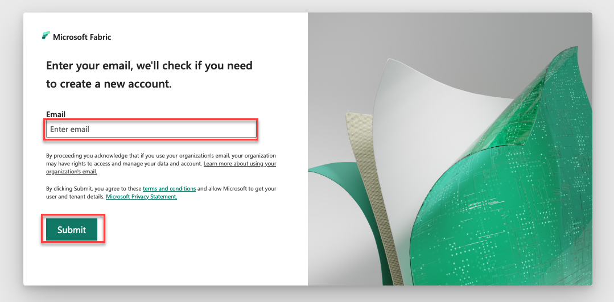
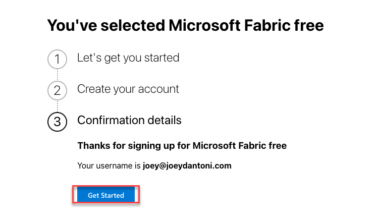
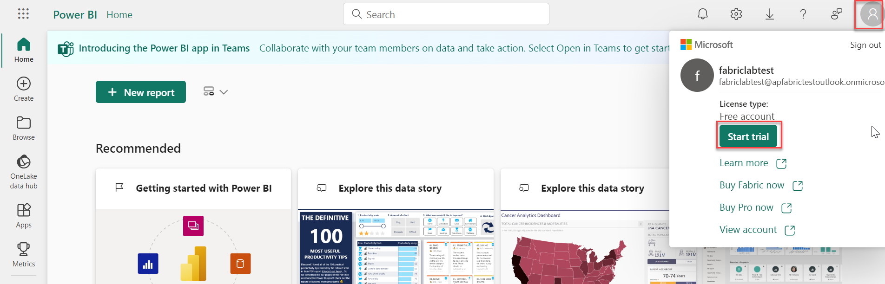
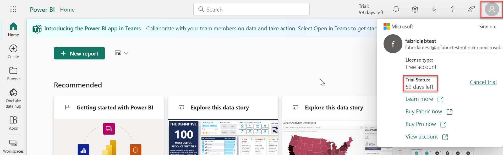
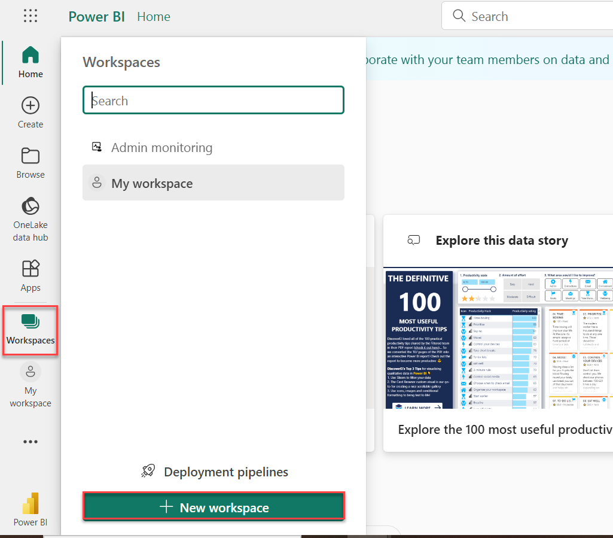
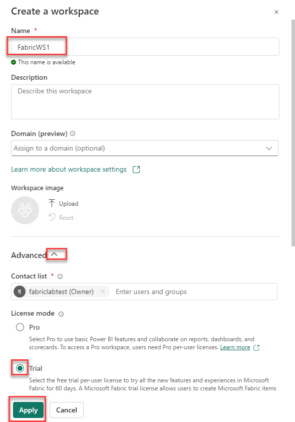
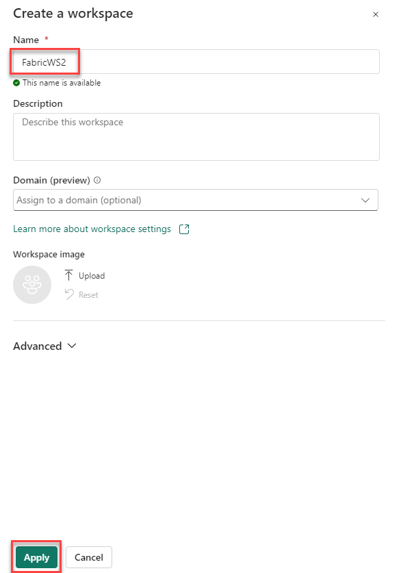

# Lab Guide

## Getting Started with Microsft Fabric

### Overview

In this lab you will learn to use Microsoft Fabric. Throughout the lab you will explore the various capabilities and overrall functionality of Microsoft Fabric. 

### More Information

- [Microsoft Learn Fabric Documentation](https://learn.microsoft.com/en-us/fabric/get-started/fabric-trial)

### Accessing Microsoft Fabric

Navigate to Azure Fabric via the below URL.

```
https://app.fabric.microsoft.com
```

## Exercise 1: Create an Fabric Trial

### Overview

In this exercise, you will sign up for a Power BI free license and sign up for a Fabric trial.

### Time Estimate

- 15 minutes

### Task 1: Create a NEW work account in your Azure Tenant

1. Login to https://portal.azure.com using the account you activated your Azure pass with.

1. Click the Hamburger menu in the top left and click **Microsoft Entra ID** 

1. Click **Users** on the left navigation.

1. Create a NEW user and make sure you save the user name and password. This user will be used to access the Microsoft Fabric trial. 

1. At the top of the portal click the search box and type in **Subscriptions** 

1. Click the **Azure Pass** subscription.

1. Click **Access Control** on the left.

1. Click **Add** -> **Add Role Assignmenet** 

1. Click **Privileged administrator roles** and choose **Owner** -> **Next** 

1. Click **Select Members** and select the new user you just created.

1. Click **Conditions** and choose **Allow user to assign all roles (highly privileged)**

1. Click **Review + Assign** 

This will add your user as an owner on the Azure subscription.

### Task 2: Login to Microsoft Fabric with the new account 

1. After the user is created open a new browser tab using in-private/in-cognito mode.

1. You need to sign up for a Fabric trial and Power BI license in order to use Microsoft Fabric. At the below URL sign in with the newly created account. 

    ```
    https://app.fabric.microsoft.com
    ```

    

2. You may be required to verify additional information. Click **Get Started** at the prompt to view the Fabric home page. 

    

    

4. Click the account icon at the top right then click **Start trial**. Click **Start trial** again at the prompt.  

    

5. Refresh the page then click the account icon at the top right again to verify that the trial is activated.

    

### Task 2: Create two workspaces

1. Click **Workspaces** on the left, then select **+ New workspace**. 

    

2. Enter the following information then click **Apply**. 

    - Name: **FabricWS1**

    - Advanced: **Trial**. 

    

4. Click **Workspaces** on the left again, then select **+ New workspace**. 

5. Enter the following information then click **Apply**. 

    - Name: **FabricWS2**

    


### Summary

In this exercise, you have enabled the Fabric trial. You then created two empty workspaces. 