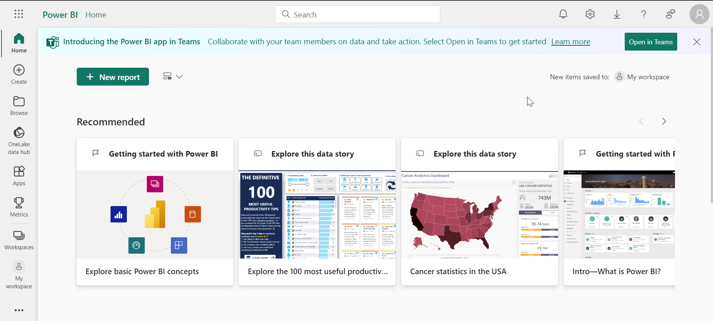

# Lab Guide

## Getting Started with Microsft Fabric

### Overview

In this lab you will learn to use Microsoft Fabric. Throughout the lab you will explore the various capabilities and overrall functionality of Microsoft Fabric. 

### More Information

- [Microsoft Learn Fabric Documentation](https://learn.microsoft.com/en-us/fabric/get-started/fabric-trial)

### Accessing Microsoft Fabric

Navigate to Azure Fabric via the below URL.

```
https://app.fabric.microsoft.com
```

## Exercise 1: Create an Fabric Trial

### Overview

In this exercise, you will sign up for a Power BI free license and sign up for a Fabric trial.

### Time Estimate

- 15 minutes

### Task 1: Sign up for a Fabric trial

1. You need to sign up for a Fabric trial and Power BI license in order to use Microsoft Fabric. At the below URL, enter the username located in the **Lab Environment** tab at the top of the Lab Player then click **Submit**. 

    ```
    https://app.fabric.microsoft.com
    ```

    

2. You may be required to verify additional information. Click **Get Started** at the prompt to view the Fabric home page. 

    

    

4. Click the account icon at the top right then click **Start trial**. Click **Start trial** again at the prompt.  

    

5. Refresh the page then click the account icon at the top right again to verify that the trial is activated.

    

### Task 2: Create two workspaces

1. Click **Workspaces** on the left, then select **+ New workspace**. 

    

2. Enter the following information then click **Apply**. 

    - Name: **FabricWS1**

    - Advanced: **Trial**. 

    

4. Click **Workspaces** on the left again, then select **+ New workspace**. 

5. Enter the following information then click **Apply**. 

    - Name: **FabricWS2**

    


### Summary

In this exercise, you have enabled the Fabric trial. You then created two empty workspaces. 