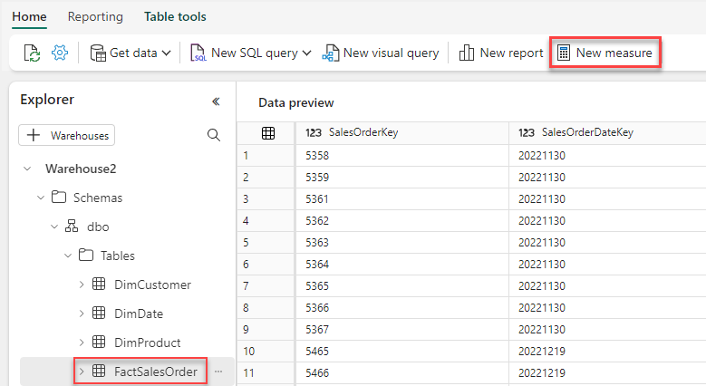

## Exercise 10: Modify the Default Power BI Dataset

### Overview

In this exercise, you will modify a default dataset generated from a warehouse and use it to create a report.

### Time Estimate

- 15 minutes

### Task 1: Modify the default dataset

1. Return to the Microsoft Fabric home page and click **Synapse Data Engineering**.

    ```
    https://app.fabric.microsoft.com/home
    ```

2. Click **Workspaces** on the left then select the the **FabricWS2** workspace.

3. Select the **Warehouse2** item with the type of **Warehouse**.

    

4. Locate the **DimCustomer** table on the left. Click the **...** next to the table and select **Remove from default dataset**. 

    

5. Select the **FactSalesOrder** table then click **New Measure**. 

    

6. In the formula bar, add the below measure then click **Commit**.  

    ```
    Products Sold = DistinctCount('FactSalesOrder'[ProductKey])
    ```

    

7. Add another measure with the below formula and click **Commit**.  

    ```
    Last Year Sales = CALCULATE(Sum(FactSalesOrder[SalesTotal]), SAMEPERIODLASTYEAR('DimDate'[DateAltKey]))
    ```

8. Click **SalesTotal** under **FactSalesOrder** on the left. Click **Model** at the bottom of the page to switch to the **Model** view and select the **Default dataset objects** tab. Confirm that the **DimCustomer** table is not shown and that the new measures are shown in **FactSalesOrder**. 

    

### Task 2: Create a report using the default dataset

1. Clickt the **Home** tab then **New report**. 

    

2. The report will open in a new browser tab. Click the **Line chart** icon to add a line chart to the page.

    

3. Expand the **DimDate** table on right. Drag the **DateAltKey** column to the **x-axis** box to add the column to the line chart's x-axis. Expand the **FactSalesOrder** table on the right. Drag the **Products Sold** column to the the **y-axis** box to add the column to the line chart's y-axis. Resize the chart to take up the top half of the page. 

    

4. Click the **Clustered Column Chart** icon to add a line chart to the page. Expand the **DimProduct** table on the right. Drag the **Category** column to the **x-axis** box to add the column to the clustered column chart's x-axis. Expand the **FactSalesOrder** table on the right. Drag the **Products Sold** column to the the **y-axis** box to add the column to the clustered column chart's y-axis. 

    

5. Click **Files** then **Save**. Enter **Product Sales** for the report name. 

### Summary

In this exercise, you modified the default dataset by removing tables and adding measures. You then used the dataset to create a report with a line chart. 