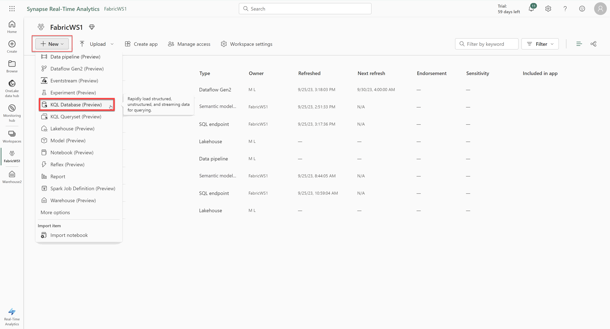
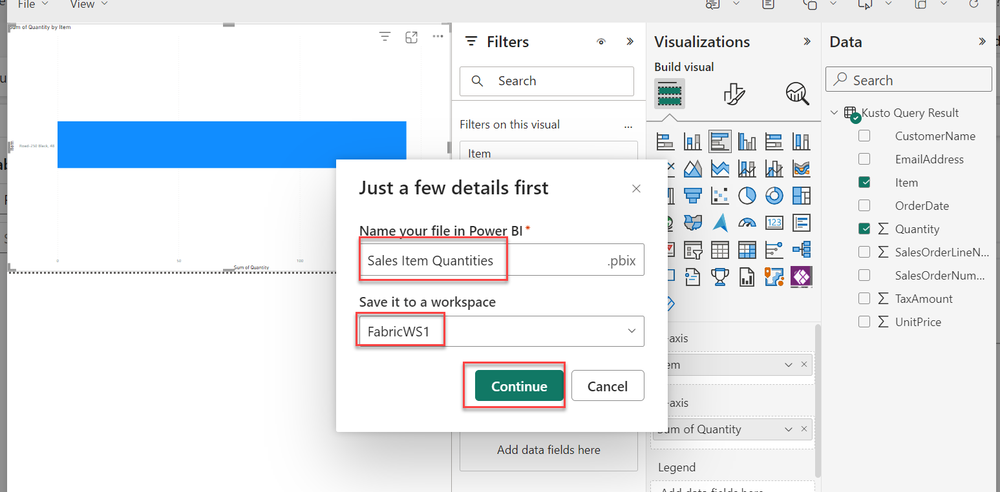

## Exercise 11: Implement real-time analytics, query the results, and make a report

### Overview

In this exercise you will create a KQL database, write a KQL query, and create a report that uses a KQL queryset. 

### Time Estimate

- 30 minutes

### Task 1: Create a KQL Database

1. Return to the Microsoft Fabric home page and click **Synapse Real-Time Analytics**.

    ```
    https://app.fabric.microsoft.com/home
    ```

    

2. Click **Workspaces** on the left then select the **FabricWS1** workspace.

3. Get the data file for this exercise from the below URL. Save the file as **sales.csv**. 

    ```
    https://raw.githubusercontent.com/MicrosoftLearning/dp-data/main/sales.csv
    ```

4. Return to browser tab with Microsoft Fabric. Click **+ New** then **KQL Database (Preview)**. 

    

5. Enter **RTDB** for the **KQL Database name** and click **Create**. 

    

6. Click **Get Data** then **Local file**. 

    

7. In the **Ingest Data** dialog that appears, select **+ New table** then enter **Sales** for the table name. Then click **Browse for files**. 

    

8. Select the **sales.csv** file then click **Next**. Click **Finish**. 

    

<!-- 9. Enter the following information then click **Next: Summary**.  

    - Compression type: **Uncompressed**

    - Data format: **CSV**

    - Ignore the first record: **Selected**

    - Mapping name: **sales_mapping** -->
9. Once the file is uploaded, click **Close**. 

    

### Task 2: Query the KQL Database

1. Select the **Sales** table on the left. Then select **Query Table** and click **Show any 100 records**. 

    

    >**Note:** You may have to refresh the page to see the table. 

2. The **Explore your data** pane will open. Replace the contents in the pane with the below query then click **Run** and review the results.

    ```
    Sales
    | where Item == 'Road-250 Black, 48'
    ```

    

3. Replace the contents in the pane with the below query then click **Run** and review the results.

    ```
    Sales
    | where Item == 'Road-250 Black, 48'
    | where datetime_part('year', OrderDate) > 2020
    ```

    

4. Click **Save as KQL queryset**, enter **Revenue by Product** for the **KQL queryset name** then click **Create**.

    

### Task 3: Query the KQL Database

1. Click **Build Power BI report**.

    

2. In the **Data** pane of the report editor, expand **Kusto Query Result** and select the **Item** and **Quantity** fields.

    

3. On the report design canvas, select the table visualization that appears, then in the **Visualization**s pane, select **Clustered bar chart**. Resize the visual to take up the entire pane. 

    

4. Click **File** and then **Save**. Enter **Sales Item Quantities** for the file name and save it in **FabricWS1**. 
    
    

   

5. Close the Power BI window then select the **FabricWS1** workspace on the left. 

6. Select the **Sales Item Quantities** report from the list and review the report. 

   

   


### Summary

In this exercise, you created a KQL database, wrote a KQL query, and created a report that uses a KQL queryset. 