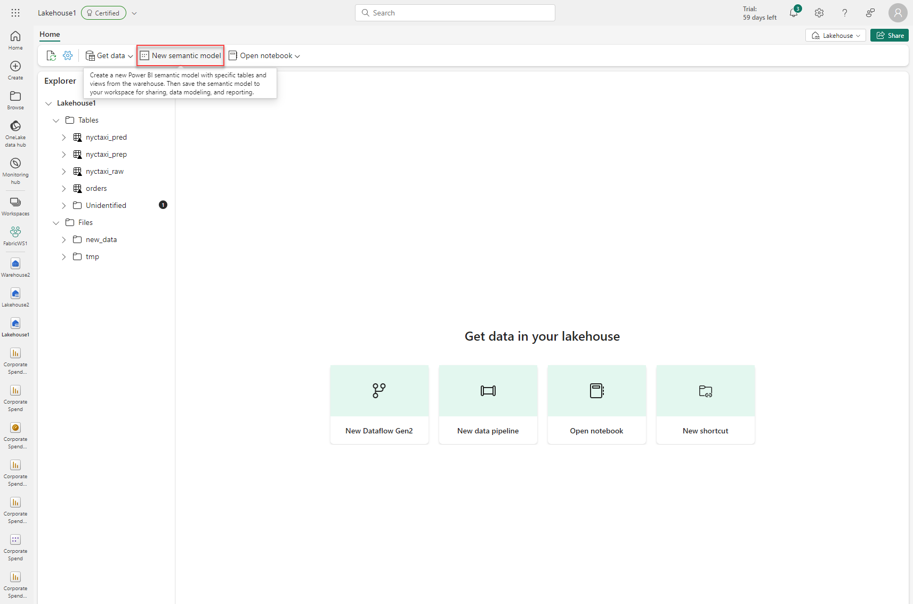

## Exercise 12: Implement a data science scenario

### Overview

In this exercise you will ingest and cleanse data, train and register machine learning models, perform batch scoring, and create a Power BI report to visualize your predictions. 
 
### Time Estimate

- 45 minutes

### Task 1: Ingest the Data

1. In a new browser tab, navigate to the below URL and download the below raw files. 

    - 01-ingest-data-into-fabric-lakehouse-using-apache-spark.ipynb

    - 02-explore-and-visualize-data-using-notebooks.ipynb

    - 03-perform-data-cleansing-and-preparation-using-apache-spark.ipynb

    - 04-train-and-track-machine-learning-models.ipynb

    - 05-perform-batch-scoring-and-save-predictions-to-lakehouse.ipynb

    ```
    https://github.com/microsoft/fabric-samples/tree/main/docs-samples/data-science/data-science-tutorial
    ```

2. Return to the Microsoft Fabric home page and click **Synapse Data Science**.

    ```
    https://app.fabric.microsoft.com/home
    ```

    

3. Click **Workspaces** on the left then select the **FabricWS1** workspace.

4. Go to the workspace settings. Locate the Spark settings under Data Engineering/Science. Choose the Environment tab. Set the Runtime Version to 1.1 (Spark 3.3, Delta 2.2). Then Close the Workspace Settings dialog.

        


5. Click **Home** on the left. Select **Import notebook** and upload the notebook files that you downloaded in step 1. 

    

6 Go to the **FabricWS1** workspace and open the **01-ingest-data-into-fabric-lakehouse-using-apache-spark** notebook. 

    

7. Click **Add** under **Add Lakehouse** on the left. Select **Existing Lakehouse** then click **Add**. Select **Lakehouse1** then click **Add**. 

8. Run the first cell in the notebook using the **Play** icon. When the run is complete, expand **Spark jobs** and review the information. Run cells 2 and 3 as well. 

    

9. Click the **...** icon next to the **Tables** folder on the left then click **Refresh**. Confirm that the **nyctaxi_raw** table is present.  

    

### Task 2: Explore the Data

1. Navigate to the **FabricWS1** workspace and open the **02-explore-and-visualize-data-using-notebooks** notebook.

    

2. Click **Add** under **Add Lakehouse** on the left. Select **Existing Lakehouse** then click **Add**. Select **Lakehouse1** then click **Add**. Run cells 1 - 3 using the **Play** icons in each cell. 

3. Review the visuals created in the output of cell 3. 

    

4. Run cell 4 and review the visual created in the output. 

    

5. Run cell 5 and review the visual created in the output. 

    

6. Run cell 6 and review the visual created in the output.

    

7. Run cell 7 and compare the two visuals created in the output.

    

8. Run cell 8 and review the two visuals created in the output. 

    

9. Run cell 9 and review the visual created in the output.

    

10. Run cell 10 and review the resulting heatmap visual. 

    

11. Run cell 11 and review the visual created in the output. 

    

12. Read the observations listed at the end of the notebook. 

    

### Task 3: Cleanse and Prepare the Data

1. Navigate to the **FabricWS1** workspace and open the **03-perform-data-cleansing-and-preparation-using-apache-spark** notebook. 

    

2. Click **Add Lakehouse**. Choose **Existing Lakehouse** and select **Lakehouse1**.

3. Click **Home** then **Run All**. Executing this notebook may take a few minutes. 

    

4. Review the summary statistics shown in the output of cell 2. 

    

5. Review the text and code in cell 3. 

    

6. Confirm that you see the **nyctaxi_prep** table of the left. 

    

### Task 4: Train and Register Machine Learning Models

1. Navigate to the **FabricWS1** workspace and open the **04-train-and-track-machine-learning-models** notebook. 

2. Click **Add Lakehouse**. Choose **Existing Lakehouse** and select **Lakehouse1**.

3. Run cell 1 using the **Play** icon and review the output. Confirm that the output indicates a new experiment has been created. 

    

4. Run cells 2 and 3. Review the counts in the output of cell 3. 

    

5. Review the text and code in cell 4. Then run the cell. 

    

6. Review the text and code in cell 5. Then run the cell. 

7. Review the code in cell 6. Then run the cell. 

8. Review the code in cell 7. Then run the cell and review the output. 

    

9. Review the code in cell 9. Then run the cell and review the output. 

10. Review the code in cell 10. Then run the cell and review the output. 

11. Review the code in cell 11. Then run the cell and review the output. 

    

12. Review the code in cell 12. Then run the cell and review the output. 

13. Run cell 13 and copy the output to **Notepad**. 

    

14. Navigate to the **FabricWS1** workspace and select the ***nyctaxi_tripduration_lightgbm** model item. Review the model properties, metrics, and parameters. 

    

    

### Task 5: Perform batch scoring and save predictions to a lakehouse

1. Navigate to the **FabricWS1** workspace and open the **05-perform-batch-scoring-and-save-predictions-to-lakehouse** notebook. 

    

2. Click **Add Lakehouse**. Choose **Existing Lakehouse** and select **Lakehouse1**.

3. In cell 3, replace **Enter the run_uri from module 04 here** in line 8 with the output you copied into **Notepad** from the previous notebook. 

    

4. Click **Home** then **Run All**. Executing this notebook may take a few minutes. 

5. Review the final predicted data in the output of cell 9. 

    

6. Refresh the **Tables** folder on the left. Confirm that you see a table called **nyctaxi_pred**. 

    

### Task 6: Create a Power BI report to visualize predictions

1. Click **OneLake data hub** on the left. 

    

2. Select **Lakehouse1**. 

    

3. Click **Open**. 

    

4. Click **New Semantic model** at the top of the page.

    

5. In the New dataset dialog, select **nyctaxi_pred** and click **Confirm**.

    

6. Once the page for the new semantic model loads, rename the semantic model by selecting the dropdown at top left and entering the name **nyctaxi_predictions**. Click outside the drop-down to apply the name change.

    

7. Click **Home** then **New report** to open the **Power BI report authoring** page.

8. Select the **slicer** option from the visualizations pane and select **pickupDate** from the data pane then drag and drop it onto the created slicer visualization field of the date slider visual.

9. Add a **clustered column** chart, add **timeBins** to the X-axis, **tripDuration** and **predictedTripDuration** to the Y-axis and change the **aggregation method** to **Average**.

    

10. Add an **area chart** visual and add **weekDayName** onto it's X-axis, **tripDuration** to it's Y-axis and **predictedTripDuration** to it's secondary Y-axis. Change the **aggregation method** to **Average** for both Y-axes.

    

11. Add a **Card** visual and add **predictedTripDuration** to the fields and change it's **aggregation method** to **Average**.

12. Add a **Card** visual and add **TripDuration** to the fields and change it's **aggregation method** to **Average**.

    

13. Click **File** then **Save**. Enter **Trip Duration Predictions** for the report name. Save the report in **FabricWS1**.

### Summary

In this exercise, you used notebooks to ingest and cleanse data, train and register machine learning models, perform perform batch scoring, and save the predictions to a lakehouse. You then created a Power BI report to visualize your predictions. 