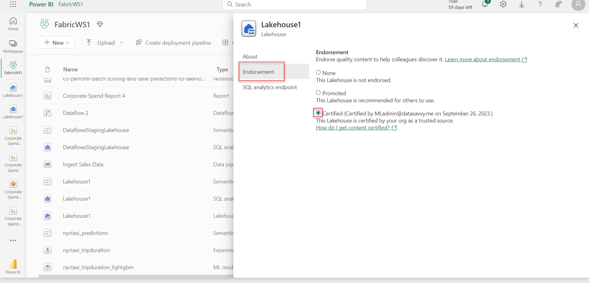

## Exercise 13: Promote and certify Fabric items

### Overview

In this exercise you will promote a report and certify a lakehouse in Fabric.
 
### Time Estimate

- 15 minutes

### Task 1: Promote a report

1. Return to the Microsoft Fabric home page and click **Power BI**.

    ```
    https://app.fabric.microsoft.com/home
    ```

    

2. Click **Workspaces** on the left then select the **FabricWS1** workspace.

3. Click the **...** next to the **Sales Items Quantities** report then select **Settings**. 

    

6. Change the **Endorsement** setting to **Promoted** then click **Save**.

    

7. Verify that the **Promoted** tag appears next to **Sales Item Quantities** in the list. 

    

### Task 2: Certify a lakehouse

1. Click the **...** icon next to the **Lakehouse1** item with the type of **Lakehouse** in the workspace list. Select **Settings**. 

    

2. Select **Endorsement** on the left then select **Certified**. Close the dialog. 

    

3. Verify that the **Certified** tag is now shown next to **Lakehouse1** in the list. 

    

### Summary

In this exercise, you used the Fabric web experience to promote a report and certify a lakehouse. 