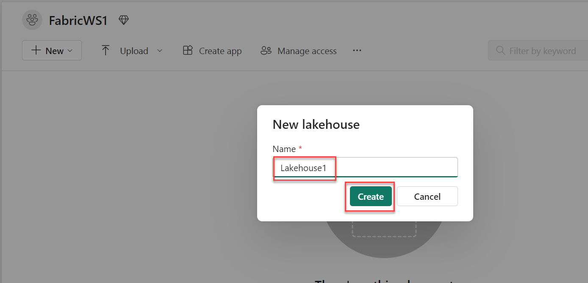
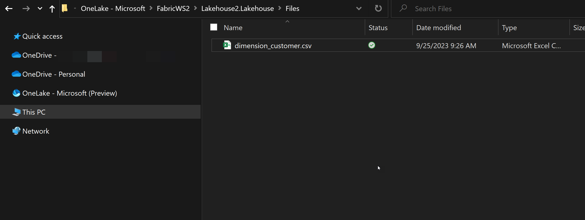

## Exercise 2: Add data with OneLake file explorer and create shortcuts

### Overview

In this exercise, you will query existing data in a data lake. Then you will query the same data from a different data lake using a shortcut. 

### Time Estimate

- 15 minutes

### Additional Info

You will need permissions to install the OneLake File Explorer on your computer/lab VM to complete this lab. 

### Task 1: Download and install OneLake File Explorer

1. Navigate to the OneLake File Explorer download page via the below URL and click **Download**.

    ```
    https://www.microsoft.com/en-us/download/details.aspx?id=105222
    ```
    

2. A .MSIX file will be downloaded to your machine. This may take several seconds. Locate the MSIX file in your downloads location and double-click it to run the installer. Click **Install** and allow the installation to complete. 

    

3. You will be asked to log in with an Entra ID account. Your Azure Credentials are available by clicking the **Lab Environment** tab at the top of the Lab Player. If prompted, choose **Sign In To This App Only**

### Task 2: Create the Lakehouses

1. Return to the Fabric home page at the below URL and select **Synapse Data Engineering**. 

    ```
    https://app.fabric.microsoft.com/home
    ```
  
    

2. Click **Workspaces** on the left then select the **FabricWS1** workspace. 

    

3. Click **+ New** then select **Lakehouse (Preview)**. 

    

4. Enter **Lakehouse1** for the Lakehouse name and click **Create**.

    

5. Click **Workspaces** on the left then select the **FabricWS2** workspace. 

    

6. Click **+ New** then select **Lakehouse (Preview)**. 

7. Enter **Lakehouse2** for the Lakehouse name and click **Create**.

### Task 3: Upload data

1. Open a new browser tab and navigate to the below **URL**. 

    ```
    https://github.com/microsoft/fabric-samples/blob/689e78676174d4627fc3855165bde9100cb4d19e/docs-samples/data-engineering/dimension_customer.csv
    ```

2. Click **Download raw file**. 

    

3. Locate and open the **OneLake** app via the start menu if it's not already oepn. A Windows Explorer window should open. You should see two folders with the same names as the two workspaces you created in Exercise 1. If you do not, right-click **OneLake - Microsoft (Preview)** on the left and click **Sync from OneLake**.  

    

4. Open the **FabricWS2** folder, then open the **Lakehouse2.Lakehouse** folder, then the **Files** folder. 

    

5. Locate the **dimension_customer.csv** file that you downloaded earlier. Copy and paste it into the **Files** folder. 

    

6. Return to the browser tab with Microsoft Fabric and ensure that you are on the **Lakehouse2** page. 

    

7. Click the **...** icon next to the **dimension_customer.csv** file then select **Load to Tables** and click **New table**. You may need to refresh the page to see the file. 

    

8. Enter **Customer** for the table name and click **Load**.

    

### Task 4: Create a shortcut

1. In the browser tab with Microsoft Fabric open, click **Workspaces** on the left then select the **FabricWS1** workspace. Select the **Lakehouse1** item with the type of **Lakehouse**.

    

2. Click **New shortcut**. 

    

3. Under **Internal Sources**, choose **Microsot OneLake**. 

    

4. Select **Lakehouse2** as your data source then click **Next**. 

    

5. Expand **Tables** then select the **Customer** table on the left then click **Create**. 
 
    

6. Select the **Customer** table shortcut on the left. You will see a preview of the data. Expand the table to see the list of fields. 
 
    

### Summary

In this exercise, you have created two lakehouses. You used OneLake File Explorer to upload a file to Lakehouse2. Then you created a table from that file. Then you created a shortcut in Lakehouse1 to access that data without copying it from Lakehouse2 to Lakehouse1.