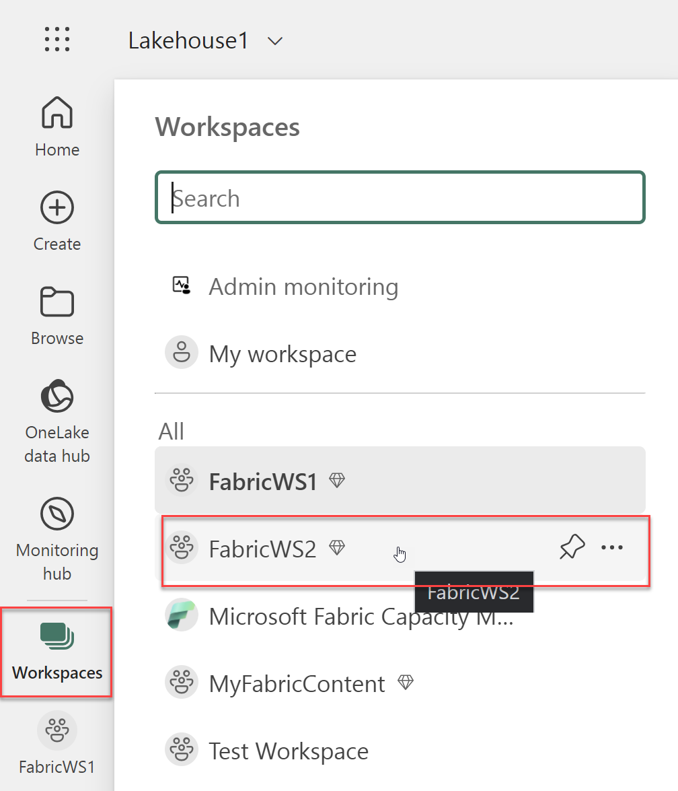
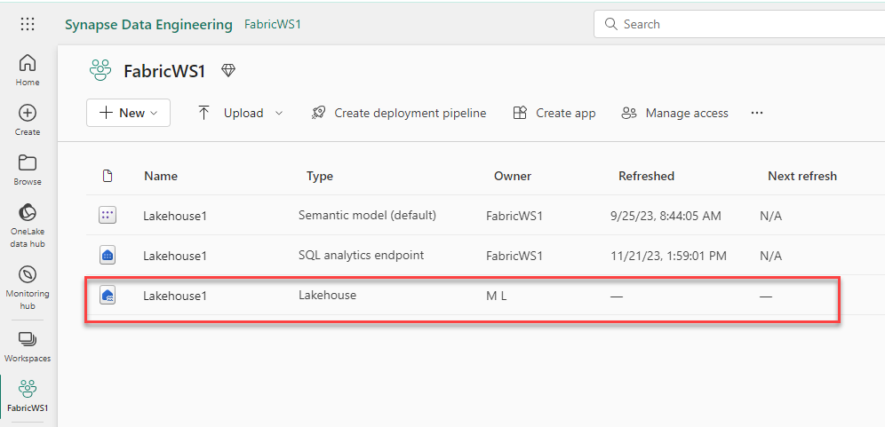
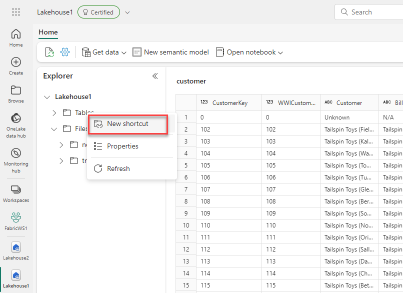

## Exercise 3: Query a Lakehouse

### Overview

In this exercise, you will use the previously created lakehouses to query the uploaded customer data. 

### Time Estimate

- 30 minutes

### Task 1: Upload data

1. Navigate to the below URL and save it to your computer as **sales.csv**. 

    ```
    https://raw.githubusercontent.com/MicrosoftLearning/dp-data/main/sales.csv
    ```

  

2. Return to the Microsoft Fabric home page and select **Synapse Data Engineering**.  
  
    ```
    https://app.fabric.microsoft.com/home
    ```

    

3. Click **Workspaces** on the left then select the the **FabricWS2** workspace. 

    

4. Select the **Lakehouse2** item with the type of **Lakehouse**. 

    

5. Click **Get data** then **Upload files**.

    

6. Click the folder icon then select the **sales.csv** file you saved earlier. Click **Upload**. Once complete, you can close the **Upload files** dialog.  

    

7. Click **Files** on the left then click the **...** icon next to the **sales.csv** file and click **Load to Tables** then **New table**. 

    

8. Enter **Sales** for the table name and click **Load**. Wait for the **Sales** table to load successfully. 

    

### Task 2: Query data in the lakehouse

1. At the top-right of the Lakehouse page, click **Lakehouse** then **SQL endpoint**. Wait a short time until the SQL query endpoint for your lakehouse opens in a visual interface from which you can query its tables. 

    

2. Click **New SQL query** to open a new query editor then enter the below SQL query. Click the **Play** icon to run the query and view the results, which should show the total revenue for each product.

    ```
    SELECT Item, SUM(Quantity * UnitPrice) AS Revenue
    FROM sales
    GROUP BY Item
    ORDER BY Revenue DESC;
    ```

    

### Task 3: Query data using a shortcut

1. Click **Workspaces** on the left then select the the **FabricWS1** workspace. 

    

2. Select the **Lakehouse1** item with the type of **Lakehouse**. 

    

3. Right-click **Tables** then click **New shortcut**. 

    

4. Under **Internal sources**, choose **Microsot OneLake**. 

    

5. Select **Lakehouse2** for your data source then click **Next**. 

     

6. Expand **Tables** on the left then select the **Sales** table and click **Create**.  

     

7. At the top-right of the Lakehouse page, click **Lakehouse** then **SQL endpoint**. Wait a short time until the SQL query endpoint for your lakehouse opens in a visual interface from which you can query its tables. 

8. Click **New SQL query** to open a new query editor then enter the below SQL query. Click the **Play** icon to run the query and view the results, which should show the total revenue for each product.

    ```
    SELECT Item, SUM(Quantity * UnitPrice) AS Revenue
    FROM sales
    GROUP BY Item
    ORDER BY Revenue DESC;
    ```

    

### Task 4: Create a visual query

1. Click **New visual query**.

    

2. Drag the **sales** table on the left to the query editor pane.

    

3. Click **Manage columns** at the top then select **Choose columns**. In the **Choose columns** menu, ensure that only the **SalesOrderNumber** and **SalesOrderLineNumber** columns are selected then click **OK**. 

    

4. Click **Transform** then select **Group by**. Enter the following information with which to group the data, then click **OK**. Review the results pane under the visual query to confirm it shows the number of line items for each sales order. 

    - Group by: **SalesOrderNumber**

    - New column name: **LineItems**

    - Operation: **Count distinct values**

    - Column: **SalesOrderLineNumber**

    

### Summary

In this exercise, you uploaded data to one lakehouse and created a shortcut to it from another lakehouse. You wrote a SQL query to access the data. Then you wrote the same SQL query, this time using the shortcut. Finally, you created a visual query that also used the shortcut. 