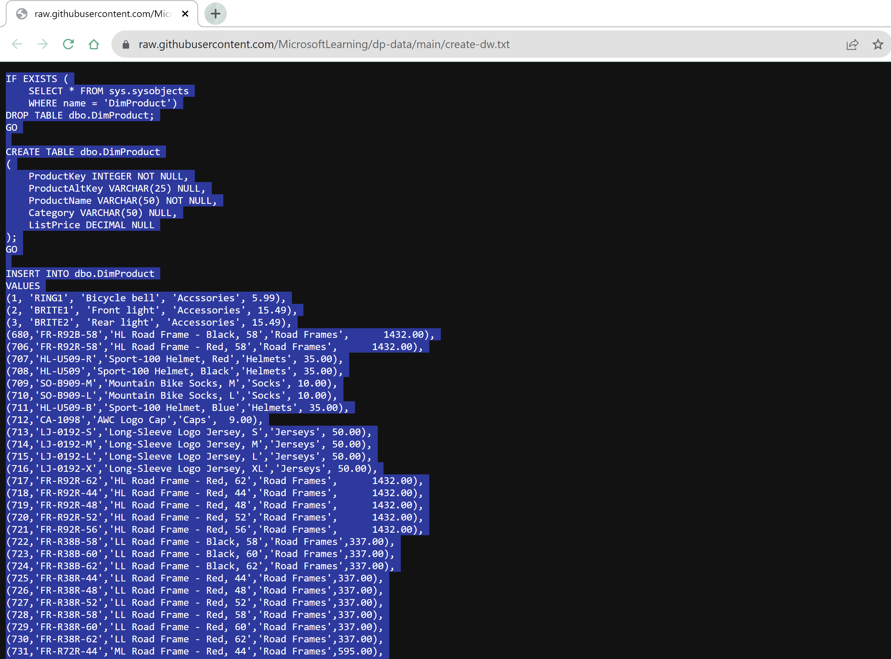
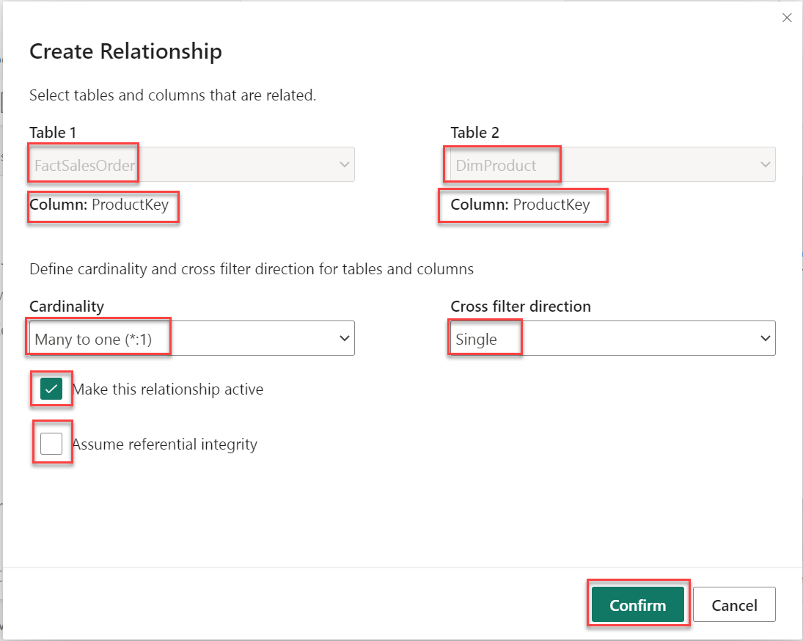

## Exercise 4: Create and Query a Data Warehouse

### Overview

In this exercise, you will create a Fabric Warehouse then query data using T-SQL. 

### Time Estimate

- 20 minutes

### Task 1: Create a warehouse and poulate it with data

1. Return to the Microsoft Fabric home page and click **Synapse Data Warehouse**.

    ```
    https://app.fabric.microsoft.com/home
    ```

    

2. Click **Workspaces** on the left then select the the **FabricWS2** workspace.

    

3. Click **+ New** then **Warehouse (Preview)**. 

    

4. Enter **Warehouse2** for the name then click **Create**. 

    

5. Click **T-SQL**.

    

6. Replace the default SQL code with the following then click the **Play** button to run the SQL script, which creates a new table called **DimProduct** in the dbo schema of the data warehouse.  

    ```
    CREATE TABLE dbo.DimProduct
    (
        ProductKey INTEGER NOT NULL,
        ProductAltKey VARCHAR(25) NULL,
        ProductName VARCHAR(50) NOT NULL,
        Category VARCHAR(50) NULL,
        ListPrice DECIMAL(5,2) NULL
    );
    GO
    ```

    

7. Click the **Refresh** icon at the top of the page then expand **Schemas > dbo > Table**  and verify that the **DimProduct** table has been created.

    

8. Click **New SQL query** to open a new query editor then enter the below Insert statement. Click the **Play** icon to run the query and insert three rows into the **DimProduct** table.

    ```
    INSERT INTO dbo.DimProduct
    VALUES
    (1, 'RING1', 'Bicycle bell', 'Accessories', 5.99),
    (2, 'BRITE1', 'Front light', 'Accessories', 15.49),
    (3, 'BRITE2', 'Rear light', 'Accessories', 15.49);
    GO
    ```

9. Click **New SQL query** again.  

10. Open a new browser tab and navigate to the below URL. Copy the contents and paste them into the SQL query tab in Microsoft Fabric. Run the query, which creates a simple data warehouse schema and loads some data. The script should take around 30 seconds to run.

    ```
    https://raw.githubusercontent.com/MicrosoftLearning/dp-data/main/create-dw.txt
    ```

    

### Task 2: Define the data model

1. Click **Model** at the bottom of the page. 

    

2. Drag the **ProductKey** field from the **FactSalesOrder** table to the **ProductKey** field in the **DimProduct** table. Verify that you have the below relationship information listed in the dialog that appears then click **Confirm**. You may have to use the scroll bar or zoom slider on the bottom of the page to see the tables in the editor. 

    - Table 1: **FactSalesOrder**

    - Column: **ProductKey**

    - Table 2: **DimProduct**

    - Column: **ProductKey**

    - Cardinality: **Many to one (*:1)**

    - Cross filter direction: **Single**

    - Make this relationship active: **Selected**

    - Assume referential integrity: **Unselected**

    

    

3. Drag the **CustomerKey** field from the **FactSalesOrder** table to the **CustomerKey** field in the **DimCustomer** table. Verify that you have the below relationship information listed in the dialog that appears then click **Confirm**. You may have to use the scroll bar on the bottom of the page to see the tables in the editor. 

    - Table 1: **FactSalesOrder**

    - Column: **CustomerKey**

    - Table 2: **DimCustomer**

    - Column: **CustomerKey**

    - Cardinality: **Many to one (*:1)**

    - Cross filter direction: **Single**

    - Make this relationship active: **Selected**

    - Assume referential integrity: **Unselected**

4. Drag the **SalesOrderDateKey** field from the **FactSalesOrder** table to the **DateKey** field in the **DimDate** table. Verify that you have the below relationship information listed in the dialog that appears then click **Confirm**. You may have to use the scroll bar on the bottom of the page to see the tables in the editor. 

    - Table 1: **FactSalesOrder**

    - Column: **SalesOrderDateKey**

    - Table 2: **DimDate**

    - Column: **DateKey**

    - Cardinality: **Many to one (*:1)**

    - Cross filter direction: **Single**

    - Make this relationship active: **Selected**

    - Assume referential integrity: **Unselected**

### Task 3: Query the data warehouse

1. Click **New SQL query** to open a new query editor then enter the below query. Click the **Play** icon to run the query and view the results. 

    ```
    SELECT  d.[Year] AS CalendarYear,
            d.[Month] AS MonthOfYear,
            d.MonthName AS MonthName,
            c.CountryRegion AS SalesRegion,
          SUM(so.SalesTotal) AS SalesRevenue
    FROM FactSalesOrder AS so
    JOIN DimDate AS d ON so.SalesOrderDateKey = d.DateKey
    JOIN DimCustomer AS c ON so.CustomerKey = c.CustomerKey
    GROUP BY d.[Year], d.[Month], d.MonthName, c.CountryRegion
    ORDER BY CalendarYear, MonthOfYear, SalesRegion;
    ```

    

### Summary

In this exercise, you created a data warehouse, populated it with data, then used T-SQL to query it. 