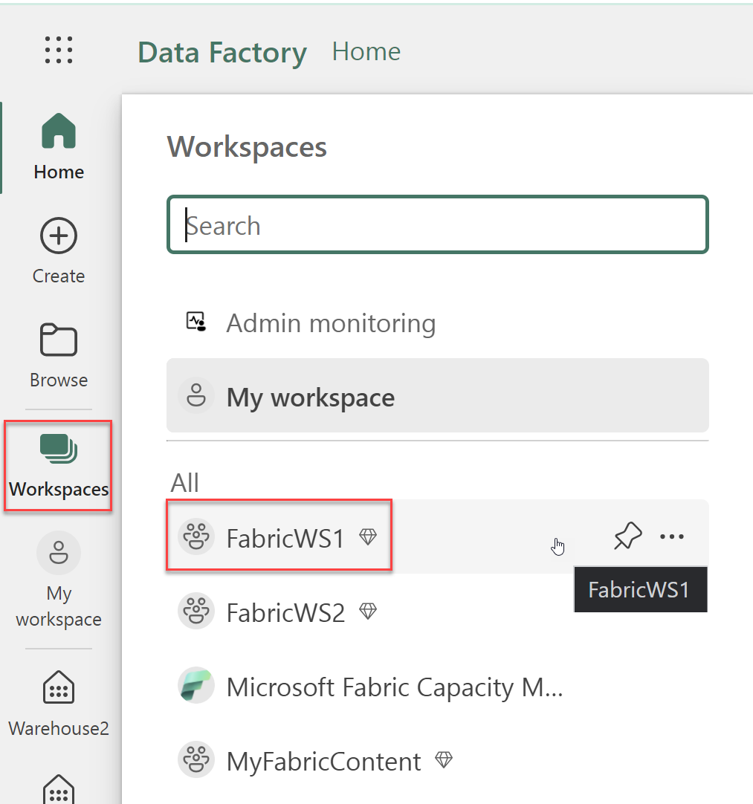
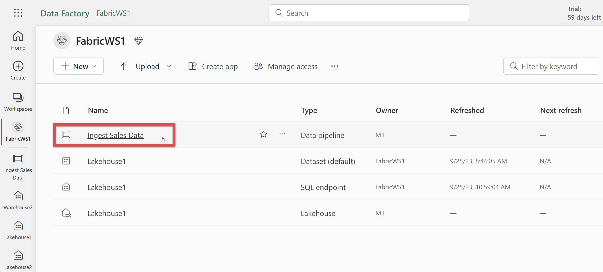
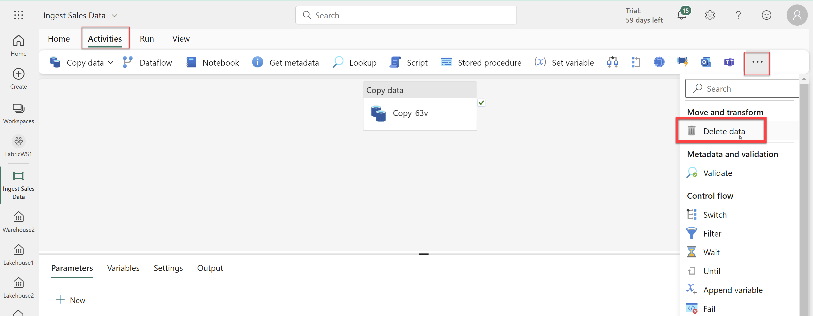
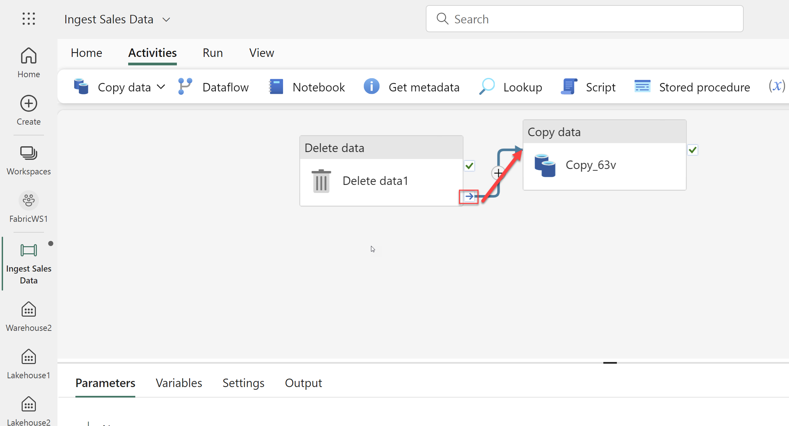
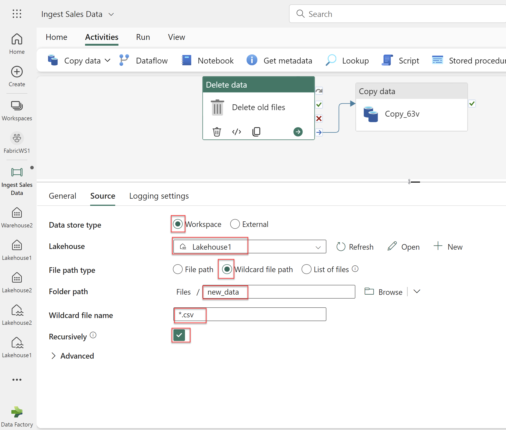
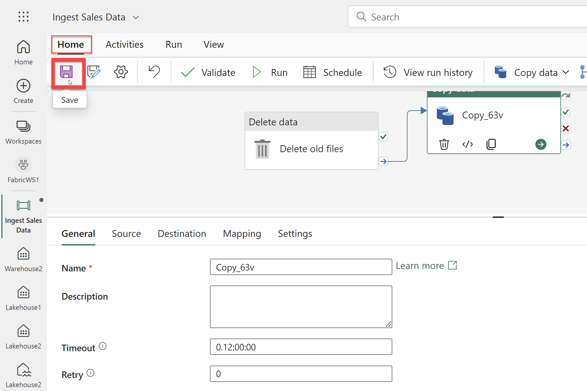
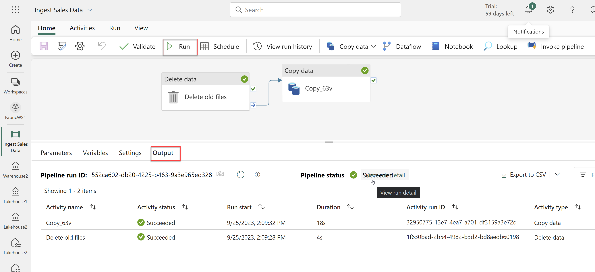
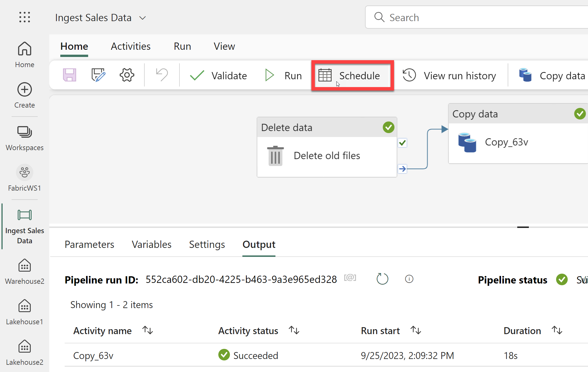
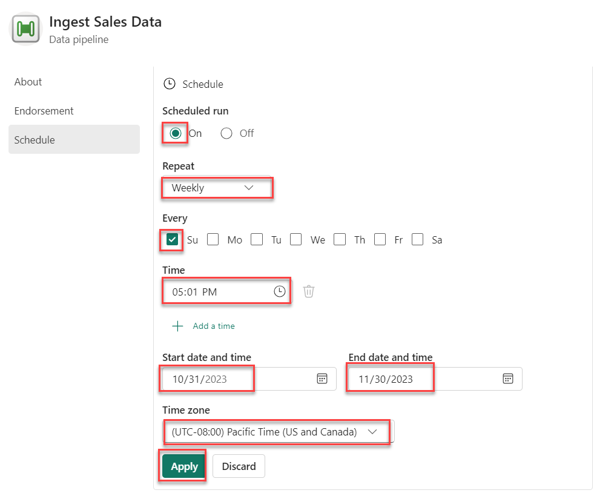

## Exercise 6: Modify a data pipeline

### Overview

In this exercise, you will change an existing data pipeline to delete data before copying then schedule the pipeline. 

### Time Estimate

- 15 minutes

### Task 1: Modify the Pipeline

1. Return to the Microsoft Fabric home page and click **Data Factory**.

    ```
    https://app.fabric.microsoft.com/home
    ```

    

2. Click **Workspaces** on the left then select the the **FabricWS1** workspace. 

    

3. Select the **Ingest Sales Data** pipeline. 

    

4. Click the **Activites** tab, then click the **...** icon on the top right, then select the **Delete data** activity to add it to the canvas.

    

5. Move the new **Delete data** activity to the left of the **Copy data** activity and connect its **On completion** output to the **Copy data** activity by clicking the small arrow icon and dragging it to the **Copy data** activity.

    

6. Select the **Delete data** activity selected then enter the below information in the pane beneath the design canvas.

    - General:
        - Name: **Delete old files**

    - Source
        - Data store type: **Workspace**

        - Workspace data store: **Lakehouse1**

        - File path type: **Wildcard file path**

        - Folder path: **Files / new_data**

        - Wildcard file name: **\*.csv**

        - Recursively: **Selected**
        
    - Logging settings:
        - Enable logging: **Unselected**

    

7. Click the **Home** tab then click the **Save** icon to save the pipeline. 

    

### Task 2: Run and Schedule the Pipeline

1. Click **Run** to run the pipeline. Wait for all of the activities to complete. Review the status and duration of the activities in the pipeline run on the **Output** tab below the canvas.
    
    

2. Click **Schedule**. Enter the following information then click **Apply**. You may then close the dialog. 

    - Scheduled run: **On**

    - Repeat: **Weekly**

    - Every: **Su**

    - Time: **5:01pm**

    - Start date and time: **Today's date**

    - End date and time: **One month from today's date**. 

    - Time zone: **Pacific Time (US and Canada)**

    

    


### Summary

In this exercise, you modified an existing pipeline to add a Delete data activity. Then you ran the pipeline to ensure it completed successfully. Finally, you schedule the pipeline to run once a week. 