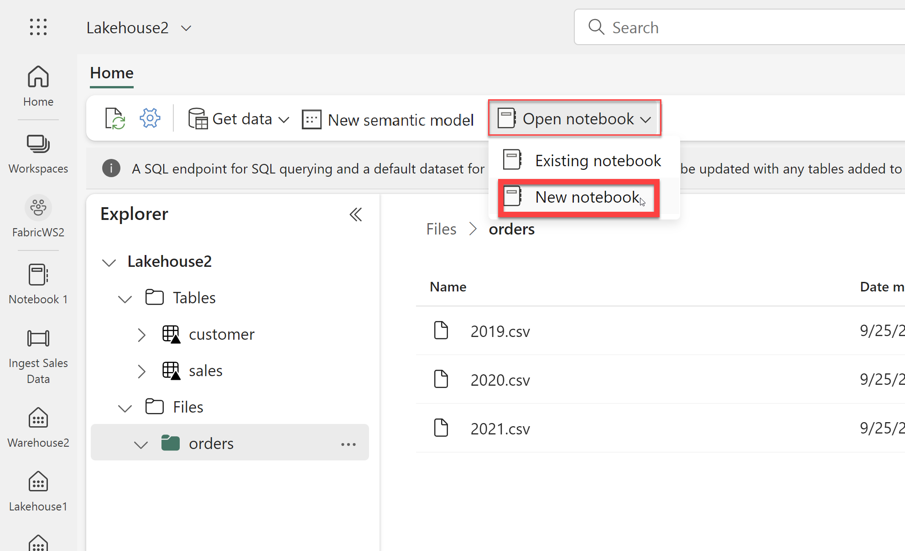
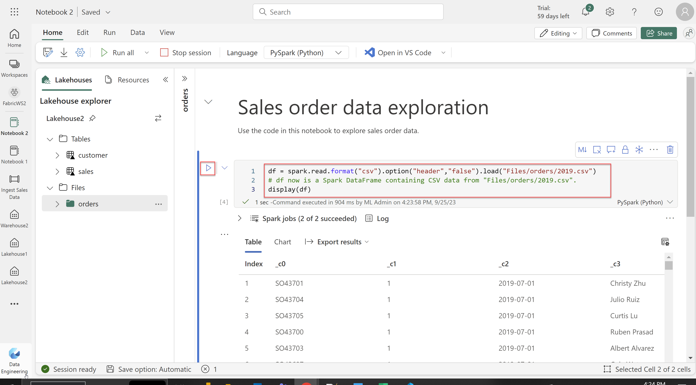

## Exercise 8: Transform data with Spark and query with SQL

### Overview

In this exercise, you will transform and query data using a Spark notebook.

### Time Estimate

- 45 minutes

### Task 1: Upload Data

1. Return to the Microsoft Fabric home page and click **Synapse Data Engineering**.

    ```
    https://app.fabric.microsoft.com/home
    ```

    

2. Click **Workspaces** on the left then select the the **FabricWS2** workspace. 

    

3. Download the zip file via the below URL. 

     ```
     https://github.com/MicrosoftLearning/dp-data/raw/main/orders.zip
     ```

4. Extract the CSV files from the zipped folder. After extracting the zipped folder, verify that you have a folder called **orders** that contains the **2019.csv**, **2020.csv**, and **2021.csv** files.

    

5. Return to the web browser tab containing your **FabricWS2** workspace. Select the **Lakehouse2** item with the type of **Lakehouse**. 

    

6. Click **...** next to **Files** then click **Upload** then **Upload folder**. Upload the **orders** folder. You can then close the **Upload** pane. 

    

7. After the files have been uploaded, expand **Files** on the left and select the **orders** folder. Verify that the CSV files have been uploaded. 
 
    

### Task 2: Explore data with a Spark notebook

1. Click **Open notebook** then **New notebook**.

    

2. Select the first cell (which is currently a code cell), then click **Convert to markdown cell**. 

    

3. Click **Edit**, then modify the markdown by replacing it with the below text. Click anywhere in the notebook outside of the cell to stop editing it and see the rendered markdown.

     ```
     # Sales order data exploration

     Use the code in this notebook to explore sales order data.
     ```

    

4. Expand **Files** on the left and select the **orders** folder. 

     

5. Click **...** next to **2019.csv**, then click **Load data** then **Spark**. 

     

6. A new code cell should be added to the notebook. Click **Run cell**. When the cell command has completed, review the output below the cell.

     

     

7. Replace the cell code with the below to set the header option to false. Click **Run cell** and review the output. 

     ```
     df = spark.read.format("csv").option("header","false").load("Files/orders/2019.csv")
     # df now is a Spark DataFrame containing CSV data from "Files/orders/2019.csv".
     display(df)
     ```

     

8. Replace the cell code with the below to define a schema and apply it when loading the data. Click **Run cell** and review the output. 

     ```
     from pyspark.sql.types import *

     orderSchema = StructType([
     StructField("SalesOrderNumber", StringType()),
     StructField("SalesOrderLineNumber", IntegerType()),
     StructField("OrderDate", DateType()),
     StructField("CustomerName", StringType()),
     StructField("Email", StringType()),
     StructField("Item", StringType()),
     StructField("Quantity", IntegerType()),
     StructField("UnitPrice", FloatType()),
     StructField("Tax", FloatType())
     ])

     df = spark.read.format("csv").schema(orderSchema).load("Files/orders/2019.csv")
     display(df)
     ```

     

9. The dataframe includes only the data from the **2019.csv** file. Replace the cell code with the below so that the file path uses a * wildcard to read the sales order data from all of the files in the orders folder. Click **Run cell** and review the output, which should now include sales for 2019, 2020, and 2021.

     ```
     orderSchema = StructType([ StructField("SalesOrderNumber", StringType()), StructField("SalesOrderLineNumber", IntegerType()), StructField("OrderDate", DateType()), StructField("CustomerName", StringType()), StructField("Email", StringType()), StructField("Item", StringType()), StructField("Quantity", IntegerType()), StructField("UnitPrice", FloatType()), StructField("Tax", FloatType()) ])

     df = spark.read.format("csv").schema(orderSchema).load("Files/orders/*.csv") 

     display(df) 
     ```

     

10. Click **+ Code** below the cell output to add a new code cell to the notebook. Enter the below code into the cell. Click **Run cell** and review the output. 

     ```
     customers = df['CustomerName', 'Email']
     print(customers.count())
     print(customers.distinct().count())
     display(customers.distinct())
     ```

     

     

11. Replace the cell code with the below. Click **Run cell**. You will then see the customers who have purchased the Road-250 Red, 52 product.

     ```
     customers = df.select("CustomerName", "Email").where(df['Item']=='Road-250 Red, 52')
     print(customers.count())
     print(customers.distinct().count())
     display(customers.distinct())
     ```

     

12. Click **+ Code** below the cell output to add a new code cell to the notebook. Enter the below code into the cell. Click **Run cell** and review the output. Note that the results show the sum of order quantities grouped by product.

     ```
     productSales = df.select("Item", "Quantity").groupBy("Item").sum()
     display(productSales)
     ```

     

13. Click **+ Code** below the cell output to add a new code cell to the notebook. Enter the below code into the cell. Click **Run cell** and review the output. Note that the results show the number of sales orders per year.

     ```
     from pyspark.sql.functions import *

     yearlySales = df.select(year(col("OrderDate")).alias("Year")).groupBy("Year").count().orderBy("Year")
     display(yearlySales)
     ```

     


### Task 3: Use Spark to transform data files

1. Click **+ Code** below the cell output to add a new code cell to the notebook. Enter the below code into the cell. Click **Run cell** to create a new dataframe from the original order data. Validate that the **Year** and **Month** columns have been added, and that the **FirstName** and **LastName** columns have been added. 

     ```
     from pyspark.sql.functions import *

     ## Create Year and Month columns
     transformed_df = df.withColumn("Year", year(col("OrderDate"))).withColumn("Month", month(col("OrderDate")))

     # Create the new FirstName and LastName fields
     transformed_df = transformed_df.withColumn("FirstName", split(col("CustomerName"), " ").getItem(0)).withColumn("LastName", split(col("CustomerName"), " ").getItem(1))

     # Filter and reorder columns
     transformed_df = transformed_df["SalesOrderNumber", "SalesOrderLineNumber", "OrderDate", "Year", "Month", "FirstName", "LastName", "Email", "Item", "Quantity", "UnitPrice", "Tax"]

     # Display the first five orders
     display(transformed_df.limit(5))
     ```

     

2. Click **+ Code** below the cell output to add a new code cell to the notebook. Enter the below code into the cell. Click **Run cell** and wait for the **Transformed data saved!** message to appear. 

     ```
     transformed_df.write.mode("overwrite").parquet('Files/transformed_data/orders')
     print ("Transformed data saved!")
     ```

     

3. Click **+ Code** below the cell output to add a new code cell to the notebook. Enter the below code into the cell. This code loads a new dataframe from the parquet files in the **transformed_orders/orders** folder. Click **Run cell** and verify that the results show the order data that has been loaded from the parquet files.

     ```
     orders_df = spark.read.format("parquet").load("Files/transformed_data/orders")
     display(orders_df)
     ```

     

### Task 4: Save the data as a table and query with SQL

1. Click **+ Code** below the cell output to add a new code cell to the notebook. Enter the below code into the cell. This code saves the dataframe of sales order data as a table called **salesorders**. Click **Run cell** and review the results. 

     ```
     # Create a new table
     df.write.format("delta").saveAsTable("salesorders")

     # Get the table description
     spark.sql("DESCRIBE EXTENDED salesorders").show(truncate=False)
     ```

     

2. Click the **...** icon next to the **Tables** folder on the left, and select **Refresh**. Expand the **Tables** folder and verify that the **salesorders** table has been created.

     

3. Click the **...** icon next to the **salesorders** table, then click **Load data** and select **Spark**.

4. A new code cell containing code similar to what's depicted in the below image is added to the notebook. Click **Run cell**. 

     

5. Click **+ Code** below the cell output to add a new code cell to the notebook. Enter the below code into the cell. Click **Run cell** and review the results. 

     ```
     %%sql
     SELECT YEAR(OrderDate) AS OrderYear,
          SUM((UnitPrice * Quantity) + Tax) AS GrossRevenue
     FROM salesorders
     GROUP BY YEAR(OrderDate)
     ORDER BY OrderYear;
     ```

     

### Summary

In this exercise, you uploaded data to a lakehouse then created a notebook to transform data. You used PySpark to query and explore the data, then write the data to a file. You then used PySpark to create a table. Finally, you used SparkSQL to query the table. 