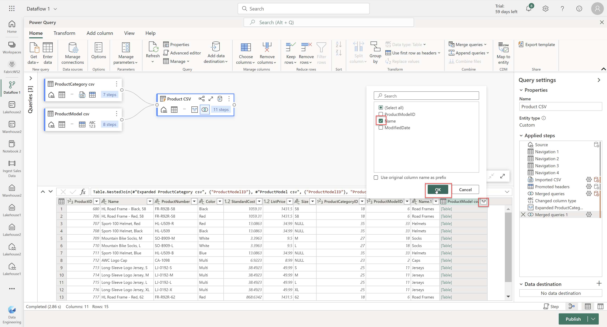

## Exercise 9: Design a dimensional model from AdventureWorks OLTP data

### Overview

In this exercise, you will work to take the data from a transactional database and denormalize it into a star schema.  

### Time Estimate

- 35 minutes

### More Information

Source files have been provided for you with this Lab. You will need to download them to your local machine if you are not working in a lab VM. 
 
This lab requires the use of OneLake File Explorer, which was installed in a previous lab. 

### Task 1: Get the source data

1. Download the below files. 

   - [Product.csv](https://opsgilitylabs.blob.core.windows.net/public/fabric/Product.CSV)

   - [ProductCategory.csv](https://opsgilitylabs.blob.core.windows.net/public/fabric/ProductCategory.csv)

   - [ProductModel.csv](https://opsgilitylabs.blob.core.windows.net/public/fabric/ProductModel.csv)

   - [SalesOrderDetail.csv](https://opsgilitylabs.blob.core.windows.net/public/fabric/SalesOrderDetail.csv)

   - [SalesOrderHeader.csv](https://opsgilitylabs.blob.core.windows.net/public/fabric/SalesOrderHeader.csv)

2. Locate and open the **OneLake** app via the start menu if it's not already oepn. A Windows Explorer window should open.

3. Navigate into the **FabricWS2** folder then into the **Lakehouse2.Lakehouse** folder. Finally, open the **Files** folder.
    
       

4. Copy the five files you downloaded to the **Files** folder. The files will sync to **Lakehouse2**.
    
       

### Task 2: Create the product dimension

1. Return to the Microsoft Fabric home page and click **Synapse Data Engineering**.

    ```
    https://app.fabric.microsoft.com/home
    ```

2. Click **Workspaces** on the left then select the the **FabricWS2** workspace. 

3. Select the **Lakehouse2** item with the type of **Lakehouse**. Select **Get Data** then click **New Dataflow Gen2**.  

       

4. Click **Get Data** then search for and select **Lakehouse** data source. Click **Next**. 

       
 
       

5. Expand the **FabricWS2** folder on the left, then expand the **Lakehouse2** folder and the **Files** folder. Select the below files then click **Create**. 

   - Product.csv

   - ProductCategory.csv

   - ProductModel.csv

       

6. Select the **Product** query then the **Transform** tab. Click **Use first row as headers**. 
   
       

7. Select the **ProductCategory** query then click **Use first row as headers**.   

8. Select the **ProductModel** query then click **Use first row as headers**. 

9. Select the **Product** query then select the **Home** tab. Click **Combine** then **Merge queries**. 

       

10. Enter the following information then click **OK**. This will Merge the **Product** query with the **ProductCategory** query based upon the **ProductCategoryID** column in each table.

   - Select the **ProductCategoryID** column at the top

   - Right table for merge: **ProductCategory csv**

      - Select the **ProductCategoryID** column

   - Join kind: **Inner**

       

11. Expand the **ProductCategory** column. Ensure that only **Name** is selected then click **OK**. 

       

12. Select the **Product** query then select the **Home** tab. Click **Combine** then **Merge queries**. 

13. Enter the following inforamation then click **OK**. This will Merge the **Product** query with the **ProductModel** query based upon the **ProductModelID** column in each table.

   - Select the **ProductModelID** column

   - Right table for merge: **ProductModel csv**

      - Select the **ProductModelID** column

   - Join kind: **Inner** 

       

14. Expand the **ProductModel** column. Ensure that only **Name** is selected then click **OK**. 

       

15. Select the **Product** query. Click the **Add column** tab then select **Index column**. 

       

16. Rename the below columns in the Product query. Do this by right-clicking each column and clicking **Rename**. Enter the name and press **Enter**. 

   - Name: **ProductName**

   - Name.1: **ProductCategory**

   - Name.2: **ProductModel**

   - Index: **ProductKey**

       

       

17. In the lower right of the page, click the **Cog** icon next to **Lakehouse** under **Data destination**. Click **Next**. 

       

18. Expand the **FabricWS2** folder on the left then select **Lakehouse2** as the data destination. Enter **Product** for the table name. Click **Next**. Click **Save settings** then click **Publish** at the bottom right of the page. 

       

### Task 2: Create the sales fact

1. Click **+ New** then **Dataflow Gen2**. 

       

2. Click **Get Data** then search for and select **Lakehouse** data source. Click **Next**.

3. Expand the **FabricWS2** folder on the left, then expand the **Lakehouse2** folder and the **Files** folder. Select the below files then click **Create**. 

   - SalesOrderHeader.csv

   - SalesOrderDetail.csv 

       

4. Select the **SalesOrderHeader** query then the **Transform** tab. Click **Use first row as headers**.

5. Select the **SalesOrderDetail** query then click **Use first row as headers**. 

6. Select the **SalesOrderDetail** query then select the **Home** tab. Click **Combine** then **Merge queries**. 

7. Enter the following inforamation then click **OK**. This will Merge the **SalesOrderDetail** query with the **SalesOrderHeader** query based upon the **SalesOrderID** column in each table.

   - Select the **SalesOrderID** column at the top

   - Right table for merge: **SalesOrderHeader**

      - Select the **SalesOrderID** column

   - Join kind: **Inner**  

       

8. Select the **SalesOrderDetail** query and expand the **SalesOrderHeader** column. Ensure that only the below columns are selected then click **OK**. 

   - OrderDate

   - ShipDate

   - SalesOrderNumber

   - PurchaseOrderNumber

       

9. Click **Get Data** then search for and select **Lakehouse** data source. Click **Next**.

10. Expand the **FabricWS2** folder on the left, then expand the **Lakehouse2** folder. Select the **Product** table then click **Create**. 

       

11. Select the **SalesOrderDetail** query then select the **Home** tab. Click **Combine** then **Merge queries**.

12. Enter the following inforamation then click **OK**. This will Merge the **SalesOrderDetail** query with the **Product** query based upon the **ProductID** column in each table.

   - Select the **ProductID** column at the top

   - Right table for merge: **Product**

      - Select the **ProductID** column

   - Join kind: **Inner**  

       

13. Expand the **Product** column. Ensure that only the **ProductKey** column is selected and click **OK**.

14. In the lower right of the page, click the **+** icon next to **Data destination** then click **Lakehouse**. Click **Next**. 

       

15. Expand the **FabricWS2** folder on the left then select **Lakehouse2** as the data destination. Enter **Sales** for the table name. Click **Next**. Click **Save settings** then click **Publish** at the bottom right of the page.

       

### Summary

In this exercise, you uploaded files from a transactional system to a lakehouse. You then used dataflows to create a product dimension and sales fact that are part of a star schema.