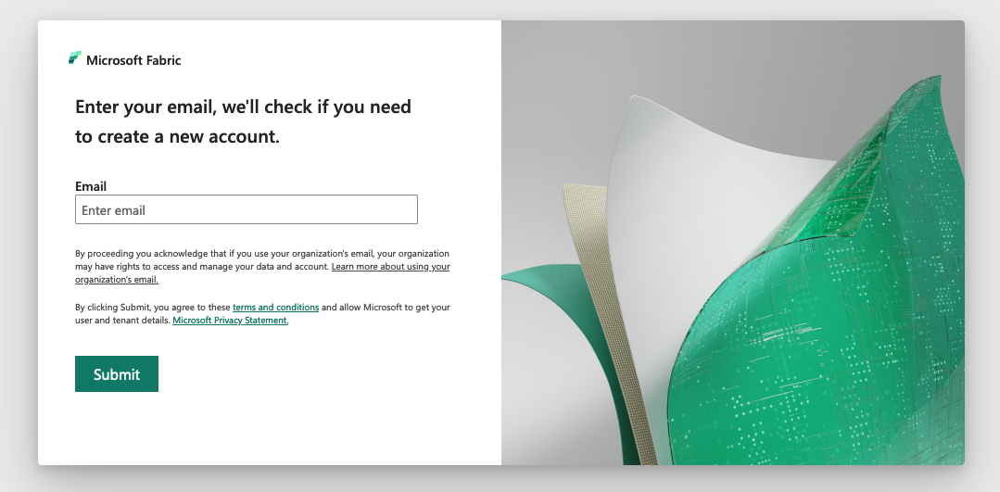
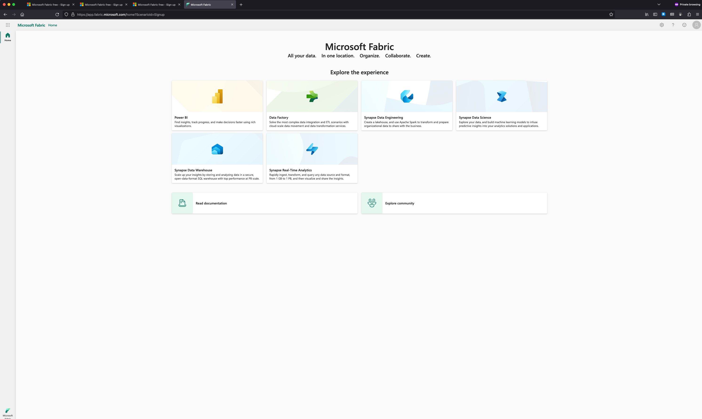
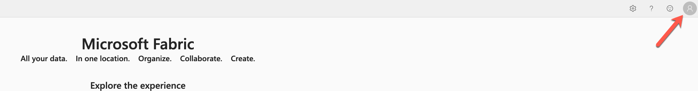
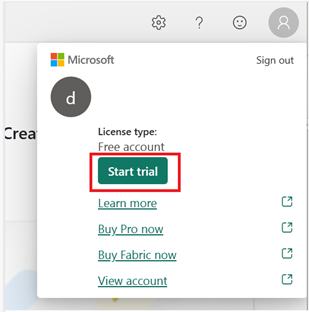
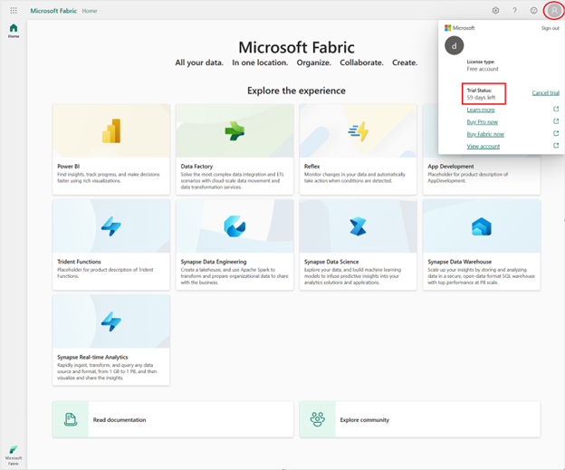

# Lab Guide

## Getting Started with Microsft Fabric

### Overview

In this lab you will enable a trial subscription to Fabric, and start your trial which you will use in other labs.

### More Information

- [Microsoft Learn Fabric Documentation](https://learn.microsoft.com/en-us/fabric/get-started/fabric-trial)

### Accessing Microsoft Fabric

Launch another Edge tab on your desktop and navigate to the below URL. Your Azure Credentials are available by clicking the **Lab Environment** tab at the top of the Lab Player.

```
https://app.fabric.microsoft.com
```

## Exercise 1: Create an Fabric Trial

### Overview

In this exercise, you will sign up for a Power BI free license and sign up for a Fabric trial.

### Time Estimate

- 15 minutes

### Task 1: Create an Azure Virtual Network

1. You need to sign up for a Power BI license, which is a requirement to get start with Fabric. Enter your username from the Azure credentials by clicking the **Lab Environment** tab at the top of the Lab Player.

    

2. Paste your email and hit submit. You may be required to verify additonal information

    

3. Click Get Started and view the Fabric home page.

    

4. In the Fabric browser window, click on the Account manager and click "Start trial"

   
   
   

   You may get another pop-up window, click "Start trail" again in that window if prompted.

6. Click on Account Management again, to verify the status of your trial.

    


### Summary

In this exercise, you have enabled the Fabric trial for your training class.
