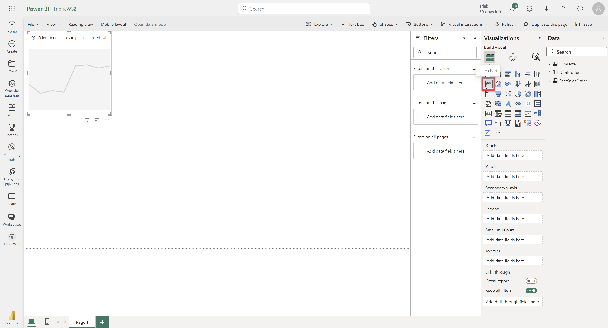
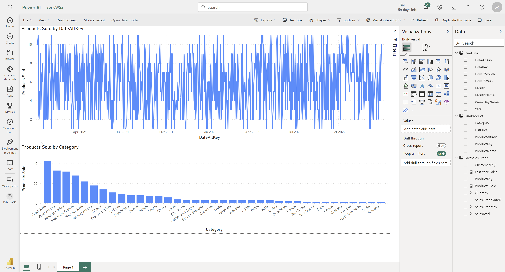

# Lab Guide

## Modify the Default Power BI Dataset
### Overview

In this lab you will modify a default dataset generated from a warehouse and use it to create a report. 
 
### Time Estimate

- 15 minutes


## Exercise 1: Modify the default dataset

### Overview

In this exercise, modify the default dataset by removing tables and adding measures. Then you will use the dataset to create a report. 

### Task 1: Modify the default dataset

1. In a web browser, navigate to the Fabric home page at https://app.fabric.microsoft.com/home. 

2. Select the Synapse Data Warehouse experience. 

3. In the menu on the left, select Workspaces and then choose the FabricWS2 workspace. 

4. Select the Warehouse2 warehouse item from the workspace. 

    

5. Locate the DimCustomer table in the Explorer. Click the ellipsis menu next to the table and choose Remove from default dataset. 

    


6. Select the FactSalesOrder table. Then select New Measure. 

7. In the formula bar, add the following measure: 
```
Products Sold = DistinctCount('FactSalesOrder'[ProductKey]) 
```

  

8. Press the commit button. 

9. Add another measure with the following formula: 
```
Last Year Sales = CALCULATE(Sum(FactSalesOrder[SalesTotal]), SAMEPERIODLASTYEAR('DimDate'[DateAltKey]))
```

  

10. Switch to the Model view and go to the Default Dataset tab. Confirm that the DimCustomer table is not shown and that the new measures are shown in FactSalesOrder. 

  


### Task 2: Create a report using the default dataset

1. Select the New report button on the Home tab. 

  

2. The report will open in a new window. Once it opens, add a line chart to the page.

 

3. Populate the line chart with DimDate[DateAltKey] on the x-axis and [Products Sold] on the y-axis. Resize the chart to take up the top half of the page. 


4. Add a clustered column chart to the page. Populate it with DimProduct[Category] in the x-axis and [Products Sold] on the y-axis. 



5. Select Files and then Save this report. Name the report Product Sales. 

### Summary

In this exercise, you modified the default dataset by removing tables and adding measures. Then you used the dataset to create a report with a line chart. 