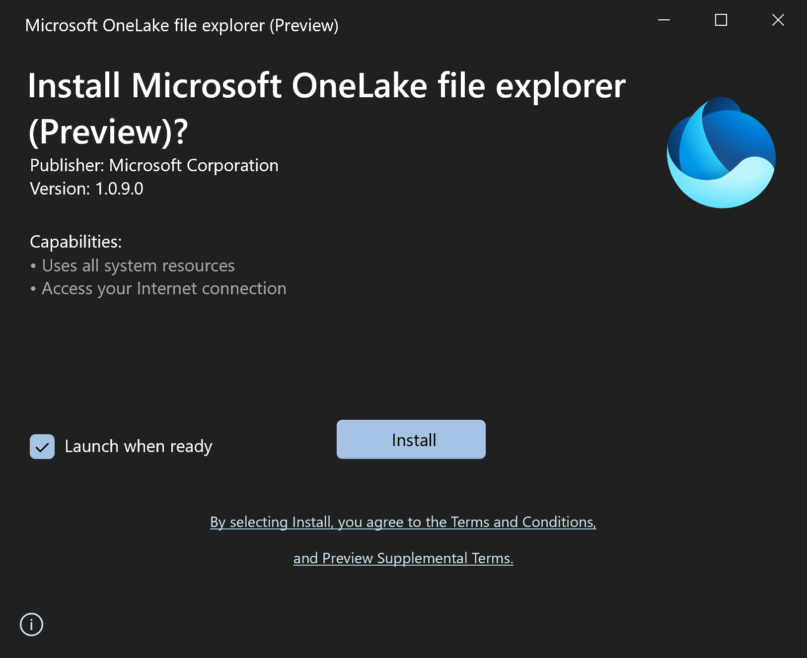

# Lab Guide

## Add data with OneLake file explorer and create shortcuts 

### Overview

In this lab you will query existing data in a data lake. Then you will query the same data from a different data lake using a shortcut. 
 
### Additional Info
You will need permissions to install the OneLake File Explorer on your computer/lab VM to complete this lab. 

### Time Estimate

- 15 minutes


## Exercise 1: Add data and create shortcuts in OneLake file explorer

### Overview

In this exercise, you will create two lakehouses. Then you will download and Install OneLake File Explorer and use it up upload data to a lakehouse. Next you will create a shortcut in the second lakehouse to see the data you uploaded to the first.   
https://www.microsoft.com/en-us/download/details.aspx?id=105222

### Task 1: Download and install OneLake File Explorer

1. Navigate to the OneLake File Explorer download page at the URL above and click Download.

    

2. A .MSIX file will be downloaded to your machine. This may take several seconds. Locate the MSIX file in your downloads location and double-click it to run the installer. 

3. Click the Install button and allow the installation to complete. 

    

4. You will be asked to log in with an Entra ID account. Your Azure Credentials are available by clicking the **Lab Environment** tab at the top of the Lab Player. 

    If prompted, choose Sign In To This App Only

### Task 2: Create the Lakehouses

1. In a web browser, navigate to the Fabric home page at https://app.fabric.microsoft.com/home. 

2. Select the Synapse Data Engineering experience. 

    

3. In the menu on the left, select Workspaces and then choose the FabricWS1 workspace. 

    

4. Select the New button and then choose Lakehouse. 

    

5. Name the lakehouse Lakehouse1 and click Create.

    

6. In the menu on the left, select Workspaces and then choose the FabricWS2 workspace. 

    

7. Select the New button and then choose Lakehouse. 

8. Name the lakehouse Lakehouse2 and click Create. 

   

### Task 3: Upload data
1. Open a new browser window and navigate to the following [URL](https://github.com/microsoft/fabric-samples/blob/689e78676174d4627fc3855165bde9100cb4d19e/docs-samples/data-engineering/dimension_customer.csv). 
```
https://github.com/microsoft/fabric-samples/blob/689e78676174d4627fc3855165bde9100cb4d19e/docs-samples/data-engineering/dimension_customer.csv
```
2. Select Download raw file. 

  

3. Locate the OneLake app in your start menu. Select it to open the app. If the app is already running, locate the OneLake icon in the system tray and double-click to open it. A Windows Explorer window should open.

  

4. You should see two folders named after the two workspaces you created in Exercise 1. Navigate into the FabricWS2 folder. You should see a folder named Lakehouse2.Lakehouse. Navigate into that folder and then into the Files folder. The Files folder should be empty. 

  

5. Locate the dimension_customer.csv file that you downloaded previously. Copy and paste it into the FabricWs2/Lakehouse2.Lakehouse/Files folder. 

  

6. Return to the browser window where you created Lakehouse2 in FabricWS2. Select the Lakehouse2 lakehouse item. 

  

7. Locate the dimension_customer.csv file in the Explorer in the web browser. Use the elipsis menu next to the file name to choose Load to Tables and then New Table. 

  

8. Name the table Customer and click Load.

  

### Task 4: Create a shortcut

1. In the menu on the left, select Workspaces and then choose the FabricWS1 workspace. 

2. Select the Lakehouse1 lakehouse item. 

 

3. Select New shortcut near the center of the window. 

 

4. Under Internal Sources, choose Microsot OneLake. 

 

5. Select Lakehouse2 as your data source. 

 

6. Select the Customer table and then click Create. 
 
 

7. Use the Explorer to navigate to the Customer table shortcut. Select the table to see a preview of the data. Select the carat next to the shortcut name to see the list of fields. 
 
 

### Summary

In this exercise, you have created two lakehouses. You used OneLake File Explorer to upload a file to Lakehouse2. Then you created a table from that file. Then you created a shortcut in Lakehouse1 to access that data without copying it from Lakehouse2 to Lakehouse1.