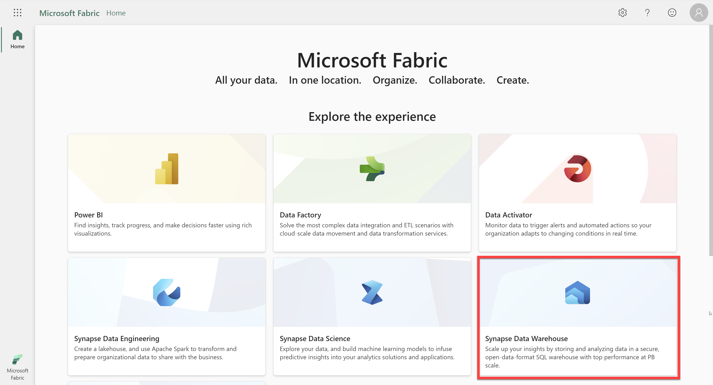
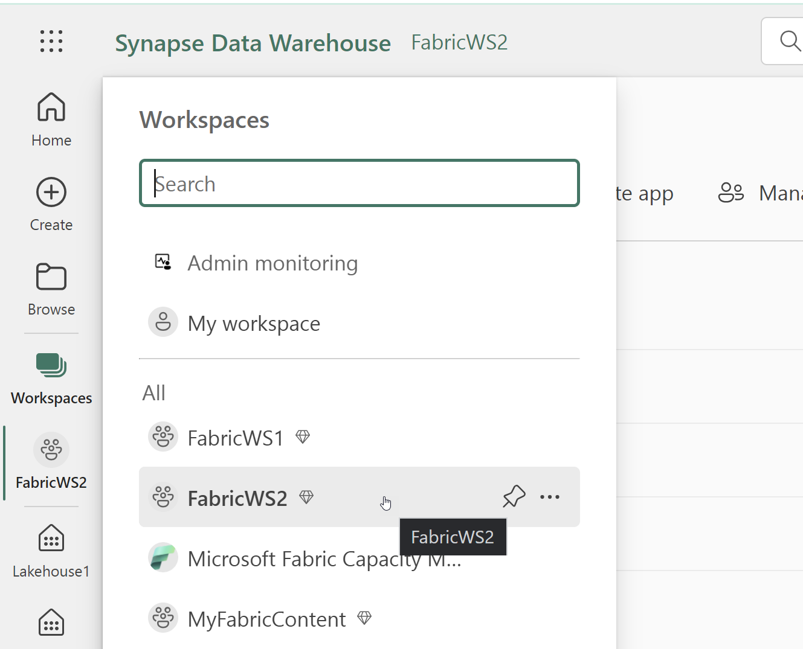
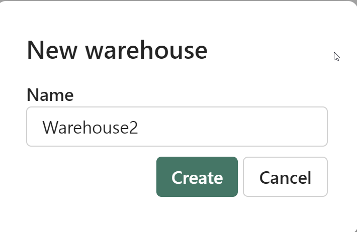
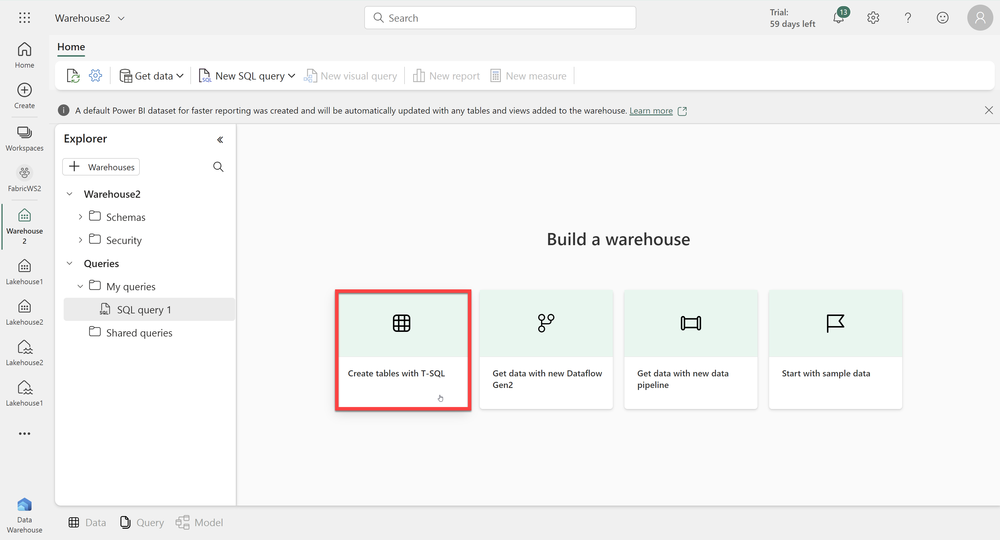
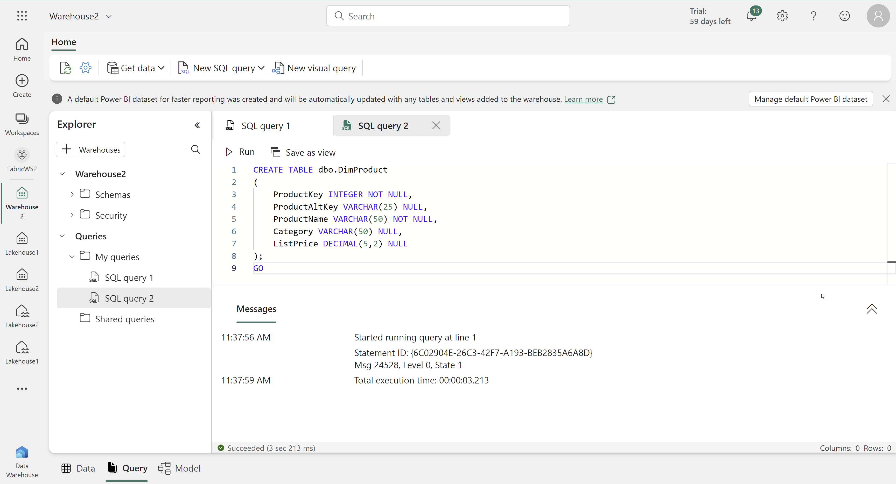
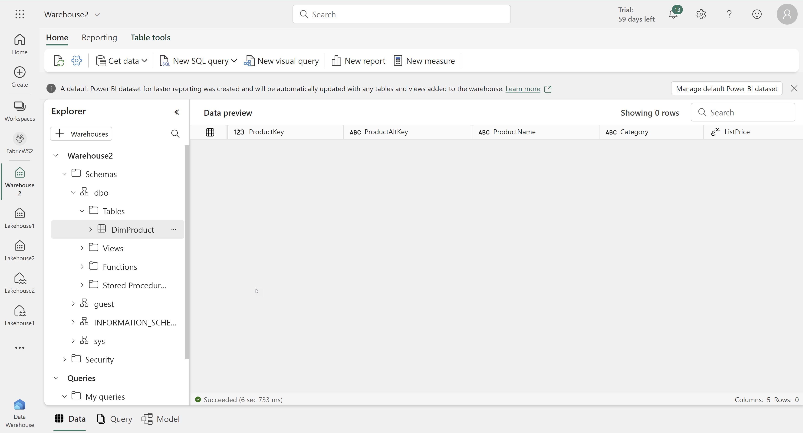
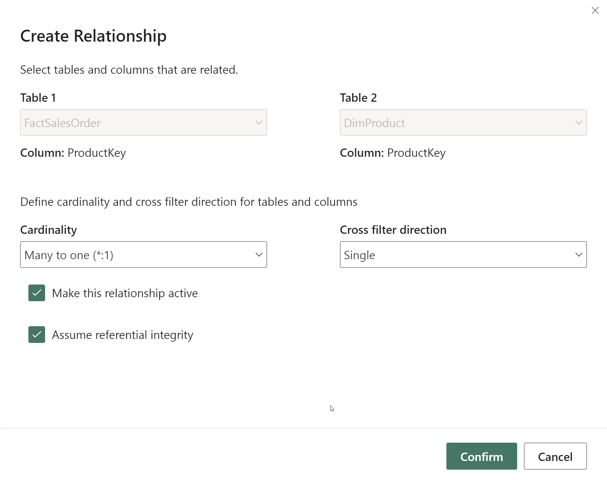
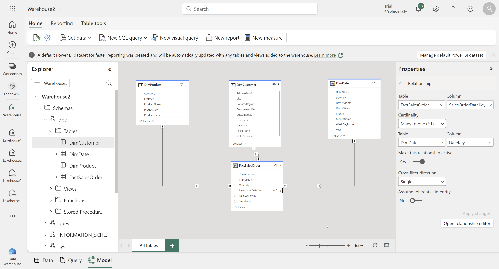
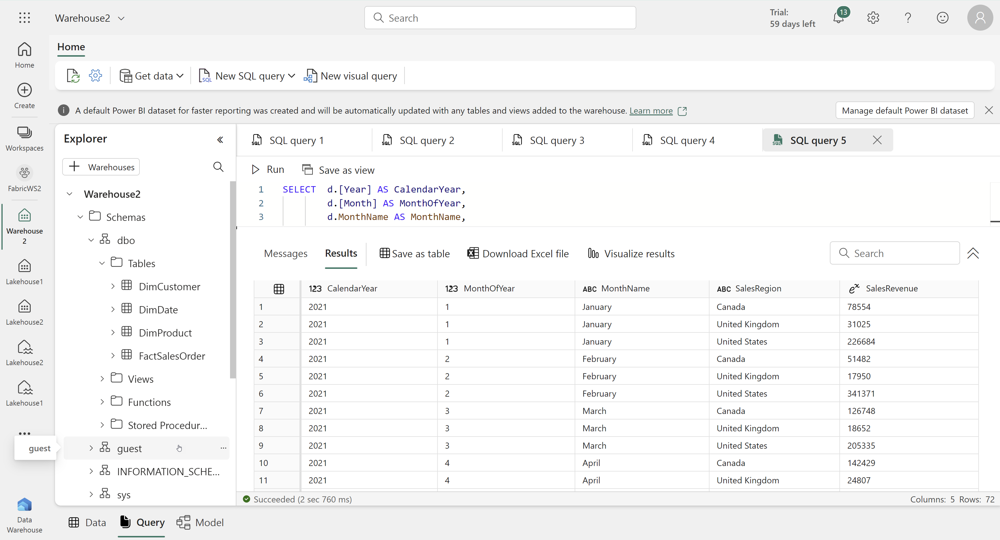

# Lab Guide

## Create and Query a Data Warehouse

### Overview
In this exercise, you will create a Fabric Warehouse and then query data using T-SQL. 

### Time Estimate

- 20 minutes

## Exercise 1: Query data uploaded to a lakehouse

### Overview

In this exercise, you will create a warehouse with sample data and then execute queries to analyze the data. 

### Task 1: Create a warehouse and poulate it with data

1. In a web browser, navigate to the Fabric home page at https://app.fabric.microsoft.com/home. 

2. Select the Synapse Data Warehouse experience. 

    

3. In the menu on the left, select Workspaces and then choose the FabricWS2 workspace. 

  

4. Select the New button and then choose Warehouse. 

  

5. Name the warehouse Warehouse2 and click Create. 

  

6. In your new warehouse, select the Create tables with T-SQL tile.

  

7. Replace the default SQL code with the following: 
```CREATE TABLE dbo.DimProduct
(
    ProductKey INTEGER NOT NULL,
    ProductAltKey VARCHAR(25) NULL,
    ProductName VARCHAR(50) NOT NULL,
    Category VARCHAR(50) NULL,
    ListPrice DECIMAL(5,2) NULL
);
GO
```
8. Use the ▷ Run button to run the SQL script, which creates a new table named DimProduct in the dbo schema of the data warehouse.

    

9. Use the Refresh button on the toolbar to refresh the view. Then, in the Explorer pane, expand Schemas > dbo > Tables and verify that the DimProduct table has been created.

    


10. On the Home menu tab, use the New SQL Query button to create a new query, and enter the following INSERT statement:
```
INSERT INTO dbo.DimProduct
VALUES
(1, 'RING1', 'Bicycle bell', 'Accessories', 5.99),
(2, 'BRITE1', 'Front light', 'Accessories', 15.49),
(3, 'BRITE2', 'Rear light', 'Accessories', 15.49);
GO
```

11. Run the new query to insert three rows into the DimProduct table.

12. Select New SQL query. 

13. Open a new browser window and navigate to https://raw.githubusercontent.com/MicrosoftLearning/dp-data/main/create-dw.txt.

    


13. Copy the contents and paste them into the SQL query window. Run the query, which creates a simple data warehouse schema and loads some data. The script should take around 30 seconds to run.

### Task 2: Define the data model

1. At the bottom of the page in the data warehouse, select the Model tab.


2. Drag the ProductKey field from the FactSalesOrder table and drop it on the ProductKey field in the DimProduct table. Then confirm the following relationship details:
- Table 1: FactSalesOrder
- Column: ProductKey
- Table 2: DimProduct
- Column: ProductKey
- Cardinality: Many to one (*:1)
- Cross filter direction: Single
- Make this relationship active: Selected
- Assume referential integrity: Unselected



3. Create many-to-one relationships between the following tables:
- FactOrderSales.CustomerKey → DimCustomer.CustomerKey
- FactOrderSales.SalesOrderDateKey → DimDate.DateKey



### Task 3: Query the data warehouse

1. Select New SQL Query. Then paste the following query: 
```
SELECT  d.[Year] AS CalendarYear,
        d.[Month] AS MonthOfYear,
        d.MonthName AS MonthName,
        c.CountryRegion AS SalesRegion,
       SUM(so.SalesTotal) AS SalesRevenue
FROM FactSalesOrder AS so
JOIN DimDate AS d ON so.SalesOrderDateKey = d.DateKey
JOIN DimCustomer AS c ON so.CustomerKey = c.CustomerKey
GROUP BY d.[Year], d.[Month], d.MonthName, c.CountryRegion
ORDER BY CalendarYear, MonthOfYear, SalesRegion;
```
2. Run the query and review the results. 




### Summary

In this exercise, you created a data warehouse, populated it with data, and then used T-SQL to query it. 