# Lab Guide

## Copy data into a lakehouse with the Copy Data Tool

### Overview

In this lab you will copy data into a lakehouse using the copy tool.
 
### Time Estimate

- 15 minutes

## Exercise 1: Use the copy tool

### Overview

In this exercise, you will copy data into an existing lakehouse. 

### Time Estimate

- 15 minutes

### Task 1: Download and install OneLake File Explorer

1. In a web browser, navigate to the Fabric home page at https://app.fabric.microsoft.com/home. 

2. Select the Data Factory experience. 

    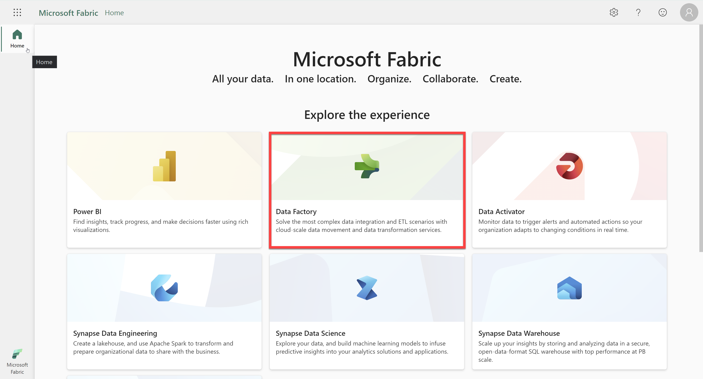

3. In the menu on the left, select Workspaces and then choose the FabricWS1 workspace. 
    

4. Select the New button and then choose Data pipeline.

    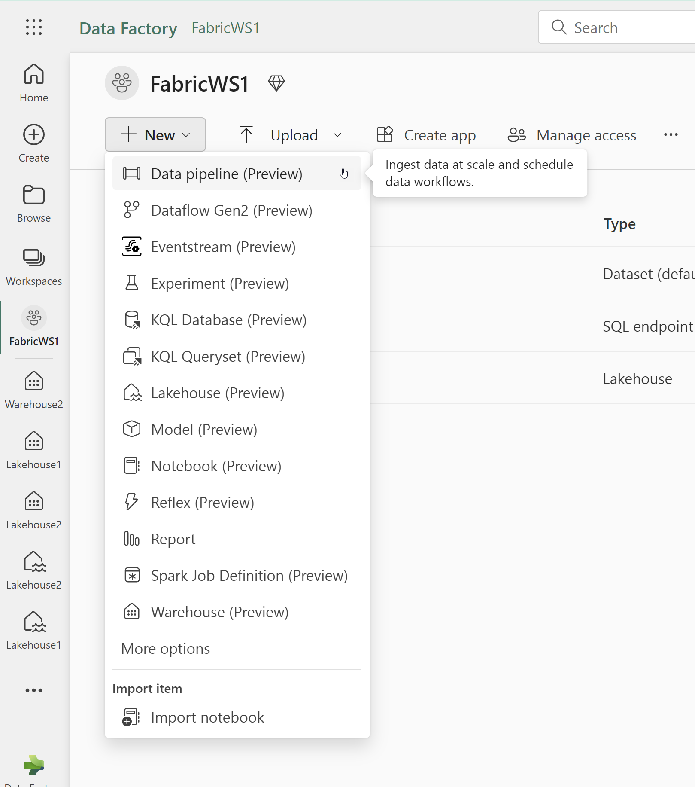

5. Name the pipeline Ingest Sales Data and click Create. 
    
    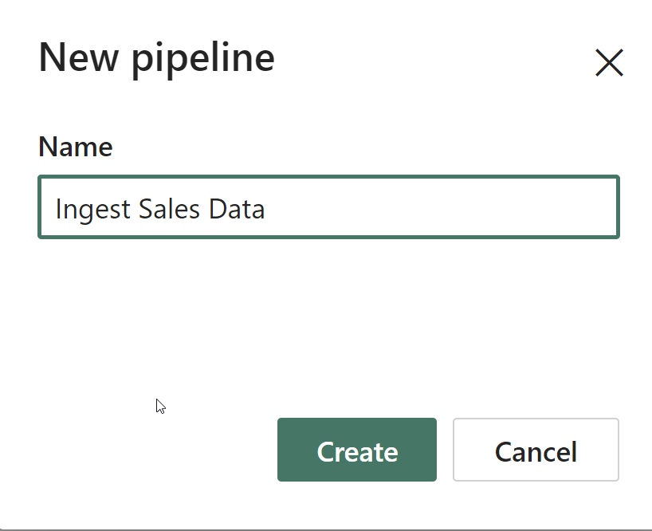

6. Select Copy Data near the middle of the screen. 
    
    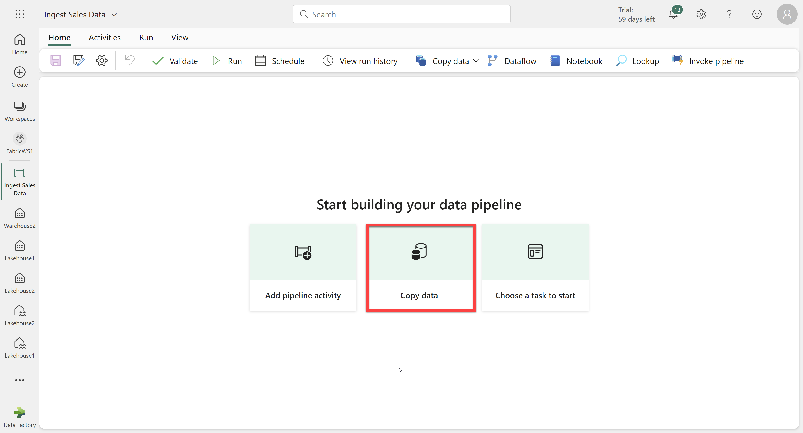

7. In the Copy Data wizard, on the Choose a data source page, in the data sources section, select the Generic protocol tab and then select HTTP.

    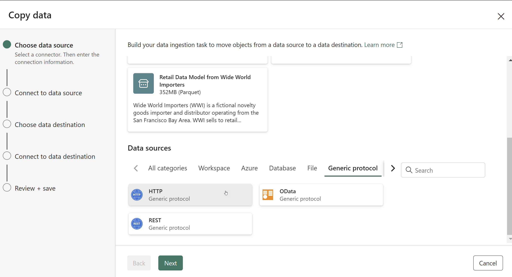

8. Select Next and then select Create new connection and enter the following settings for the connection to your data source:
- URL: https://raw.githubusercontent.com/MicrosoftLearning/dp-data/main/sales.csv
- Connection: Create new connection
- Connection name: Specify a unique name
- Authentication kind: Basic (Leave the username and password blank)

    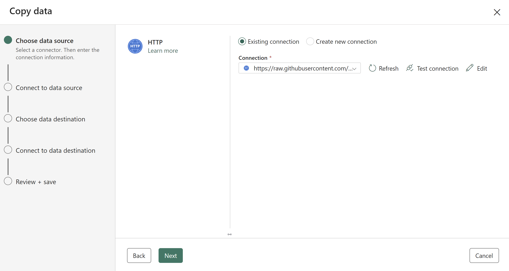

9. Select Next. Then ensure the following settings are selected:
- Relative URL: Leave blank
- Request method: GET
- Additional headers: Leave blank
- Binary copy: Unselected
- Request timeout: Leave blank
- Max concurrent connections: Leave blank

    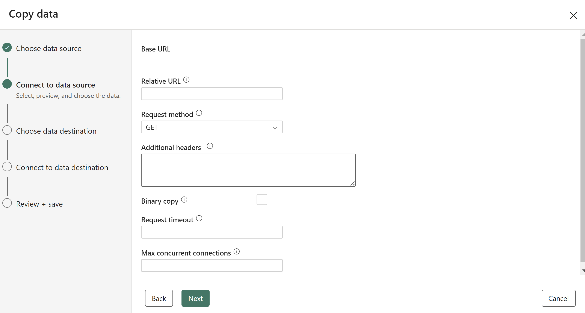

10. Select Next, and wait for the data to be sampled and then ensure that the following settings are selected:
File format: DelimitedText
Column delimiter: Comma (,)
Row delimiter: Line feed (\n)
First row as header: Selected
Compression type: None

    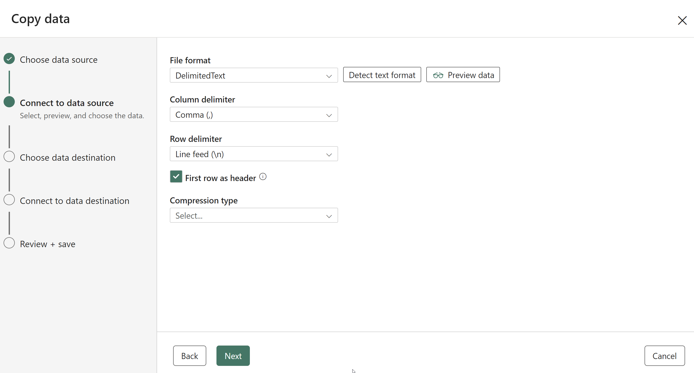

11. On the Choose data destination page, select Lakehouse1. Then select Next.

    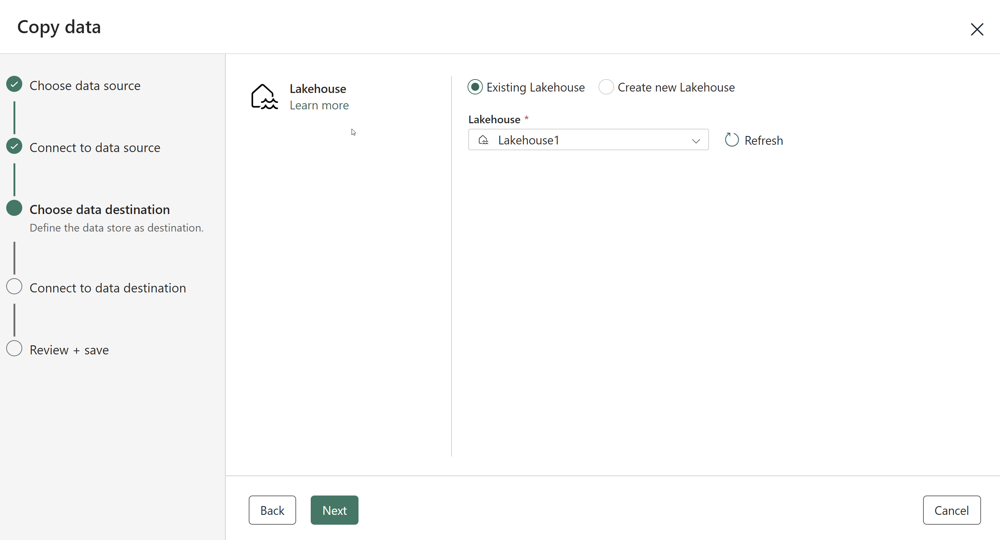

12. Set the following data destination options, and then select Next:
- Root folder: Files
- Folder path name: new_data
- File name: sales2.csv
- Copy behavior: None

    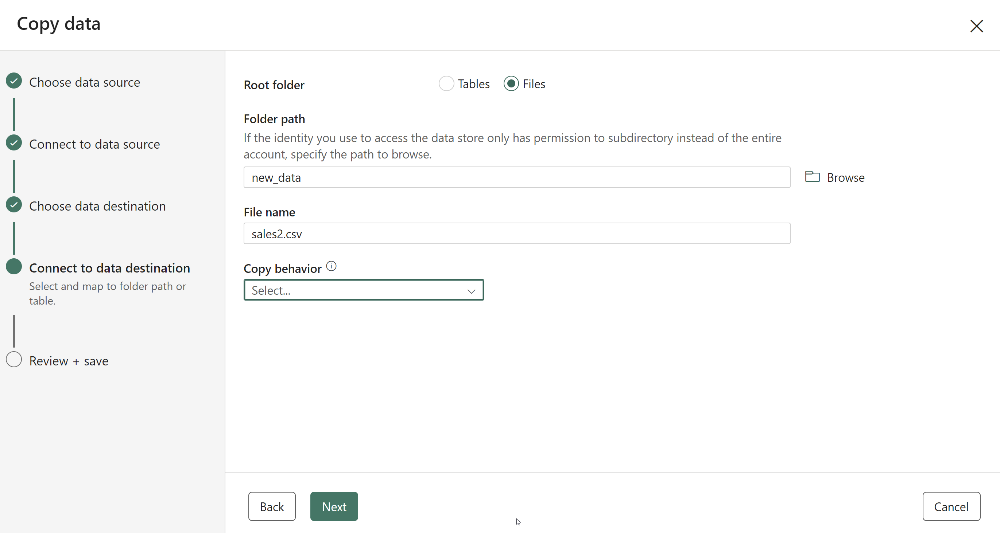

13. Set the following file format options and then select Next:
File format: DelimitedText
Column delimiter: Comma (,)
Row delimiter: Line feed (\n)
Add header to file: Selected
Compression type: None

    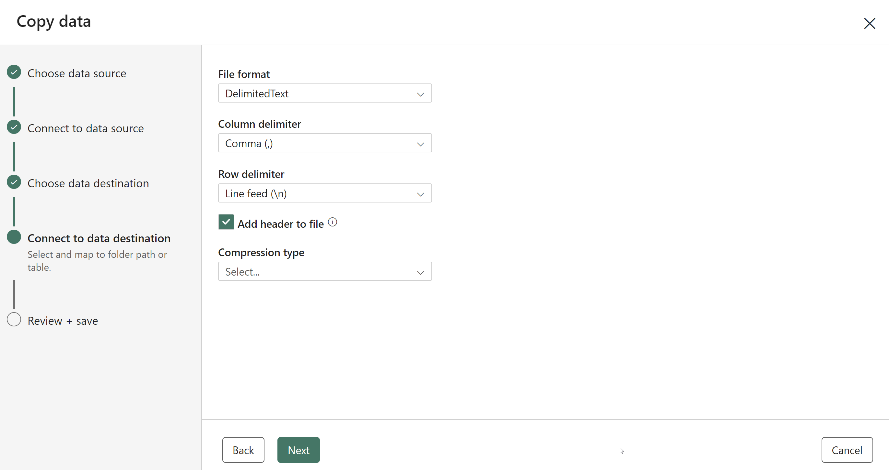

14. On the Copy summary page, review the details of your copy operation and then select Save + Run.

15. A new pipeline containing a Copy Data activity is created. The pipeline is executed immediately. Review the information on the Output tab to confirm the pipeline run succeeded. 

    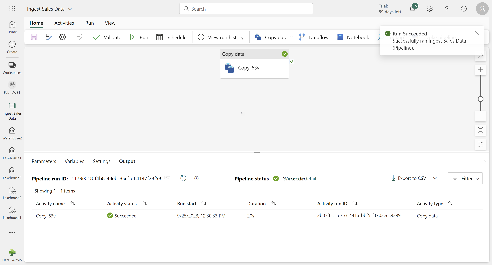

### Task 2: Review the copied data
1. Select Lakehouse1 with the icon that contains waves in the menu on the left. 

    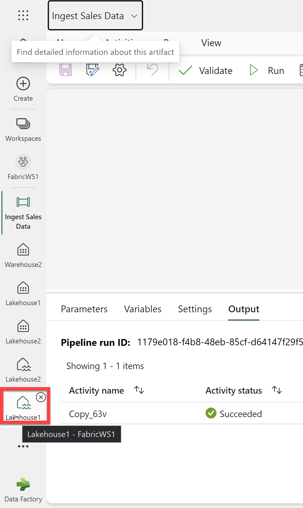

2. In the Explorer, expand Files and select the new_data folder. Verify that you see sales2.csv file. 

    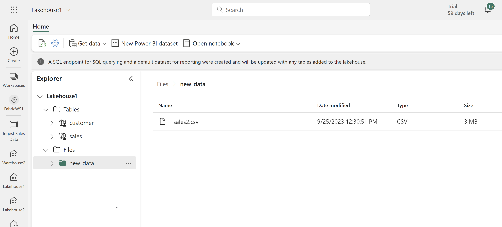

### Summary

In this exercise, you used the Copy Data tool to copy data from an HTTP source to a lakehouse and then verified the new data using the Lakehouse Explorer. 