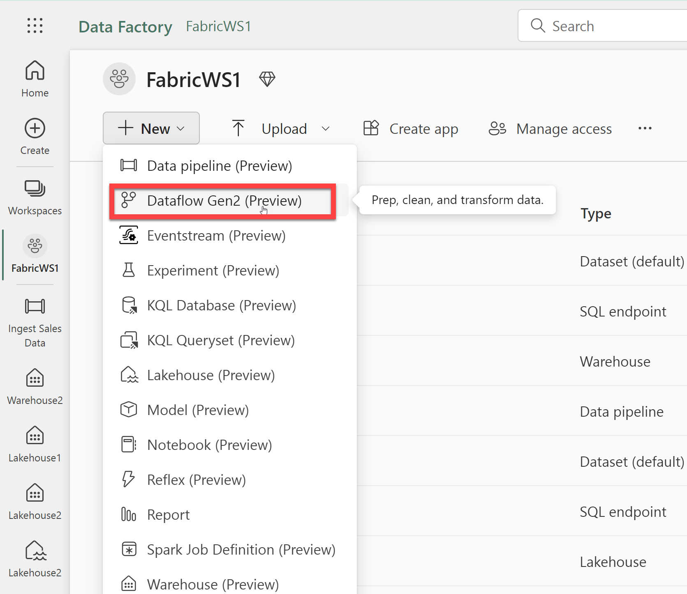
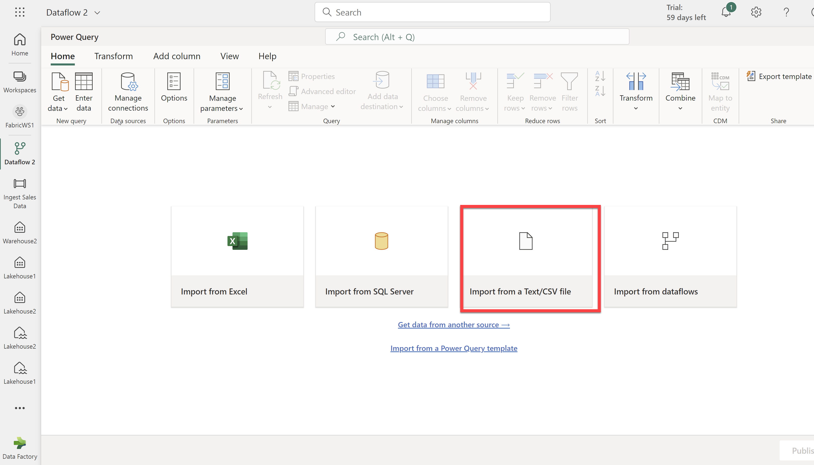
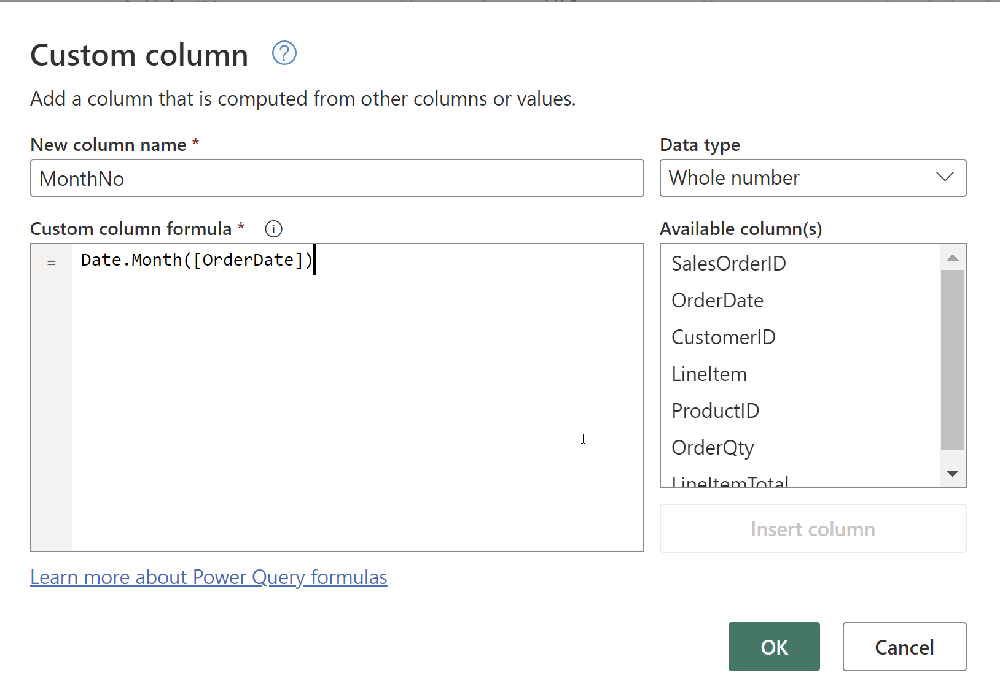
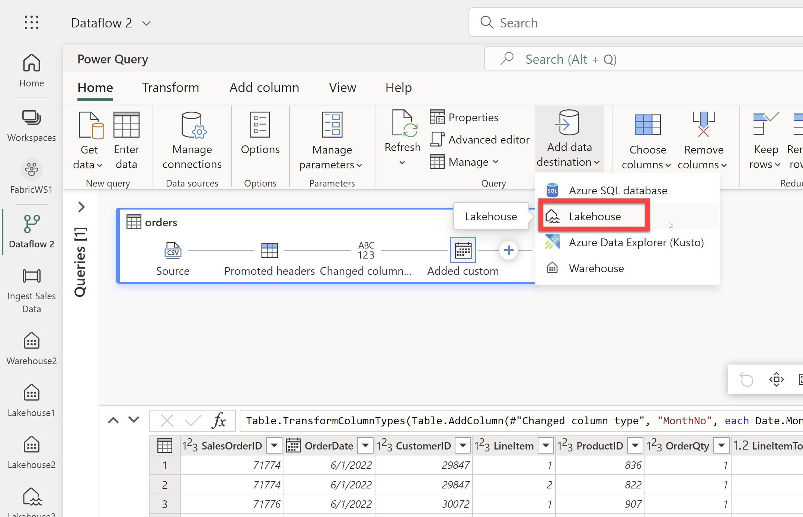
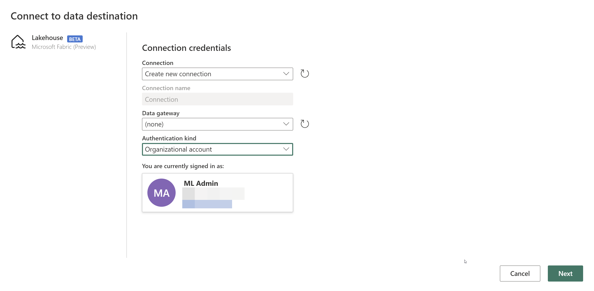
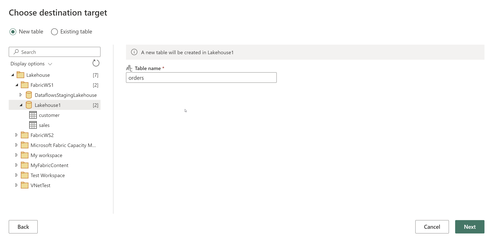
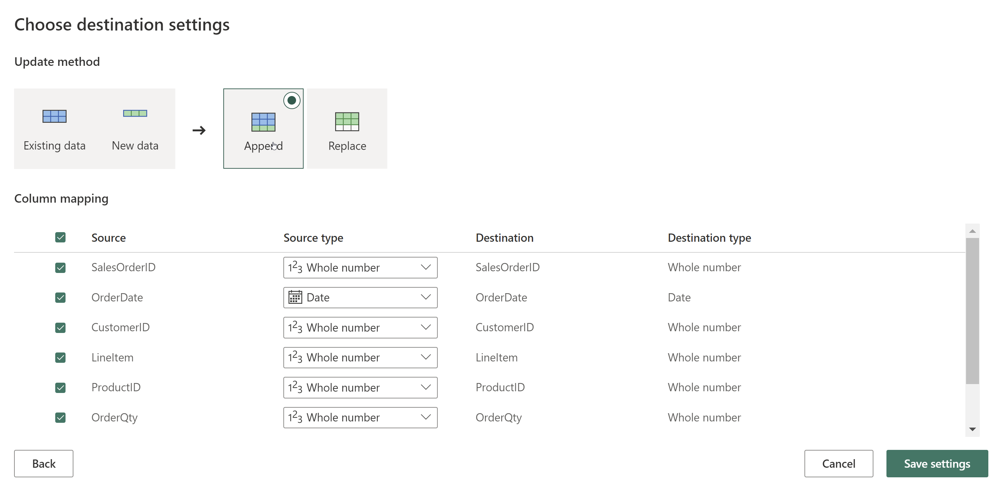
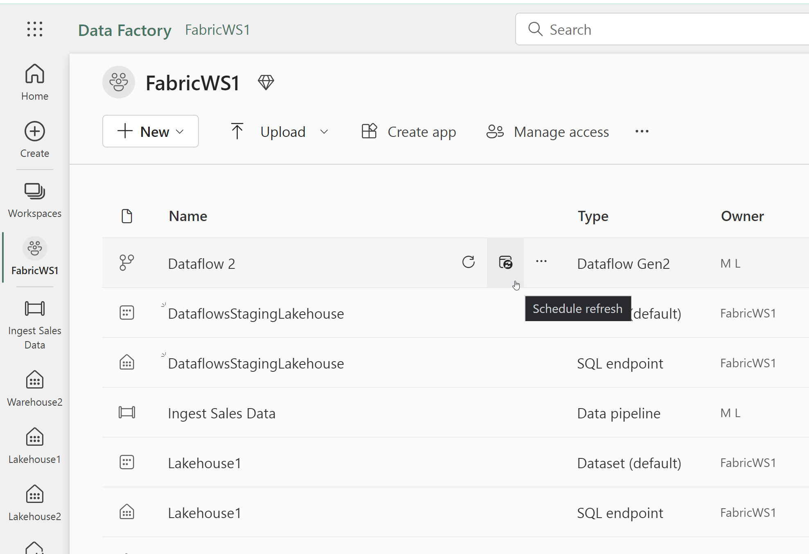
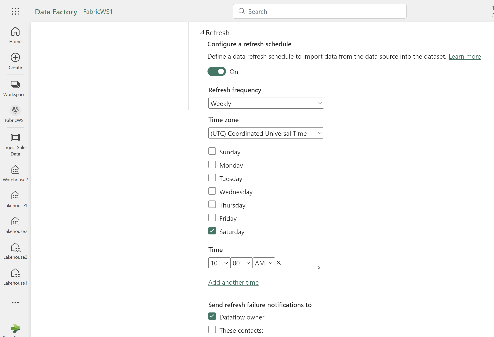

# Lab Guide

## Create a dataflow and schedule execution

### Overview
In this lab you will create and schedule a dataflow.  
 
### Time Estimate

- 15 minutes

## Exercise 1: Create and schedule a dataflow

### Overview

In this exercise, you create a dataflow and then schedule it.

### Time Estimate

- 15 minutes

### Task 1: Create a dataflow

1. In a web browser, navigate to the Fabric home page at https://app.fabric.microsoft.com/home. 

2. Select the Data Factory experience. 

    

3. In the menu on the left, select Workspaces and then choose the FabricWS1 workspace. 

    

3. Select New and then select Dataflow Gen2.
 
    

4. Select Import from a Text/CSV file

    

5. Create a new data source with the following settings: 
- Link to file: Selected
- File path or URL: https://raw.githubusercontent.com/MicrosoftLearning/dp-data/main/orders.csv
- Connection: Create new connection
- Data gateway: (none)
- Authentication kind: Anonymous

6. On the toolbar ribbon, select the Add column tab. Then select Custom column and create a new column.

7. Set the New column name to MonthNo, set the Data type to Whole Number and then add the following formula: Date.Month([OrderDate])

    

8. On the toolbar ribbon, select the Home tab. Then in the Add data destination drop-down menu, select Lakehouse.

    

9. In the Connect to data destination dialog box, edit the connection and sign in using your Power BI organizational account. Your Azure Credentials are available by clicking the **Lab Environment** tab at the top of the Lab Player.

    

10. Expand FabricWS1 and select Lakehouse1. Leave the new table named as orders. Select Next. 

    

11. On the Choose destination settings page, select Append and then Save settings. 

    

12. Select Publish. 

### Task 2: Schedule the dataflow
1. Locate the dataflow on the workspace page. Select Schedule Refresh to the right of the pipeline name. 

    

2. Expand the Refresh section of the dataflow settings. 

3. Turn on the refresh schedule and configure the dataflow scheduled refresh with the following settings.  
- Refresh frequency: Weekly
- Time zone: Coordinated Universal Time
- Day of the week: Saturday 
- Time: 10:00 AM    
    
    

4. Select Apply. 

### Summary

In this exercise, you created a dataflow that reads data from a URL, adds a custom column to calculate the month number, and lands the data in the lakehouse. Then you created a refresh schedule for the dataflow. 