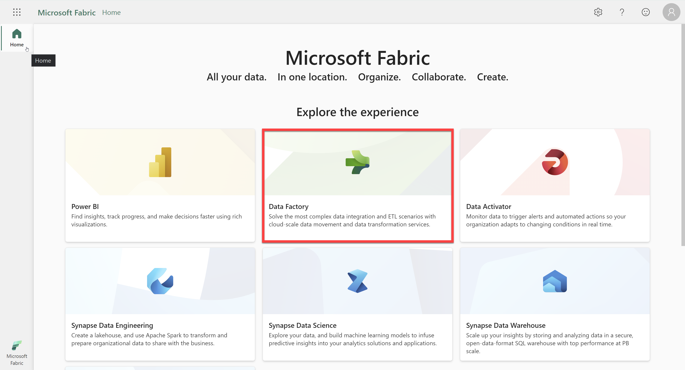
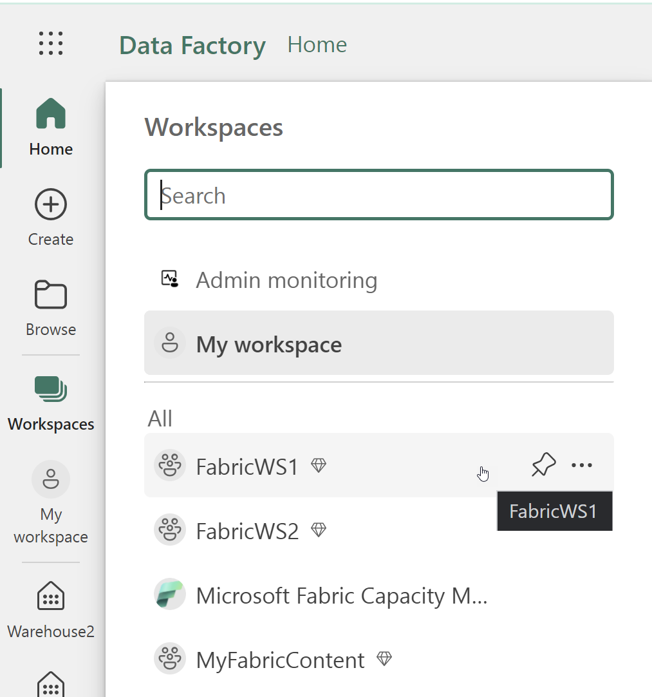
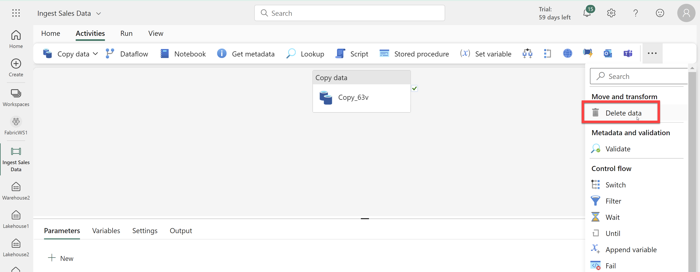
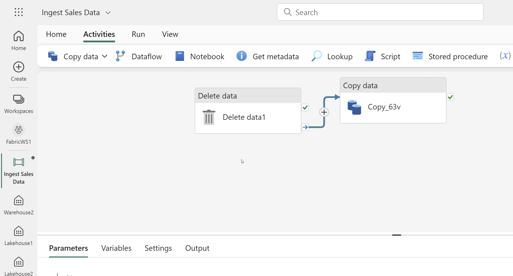
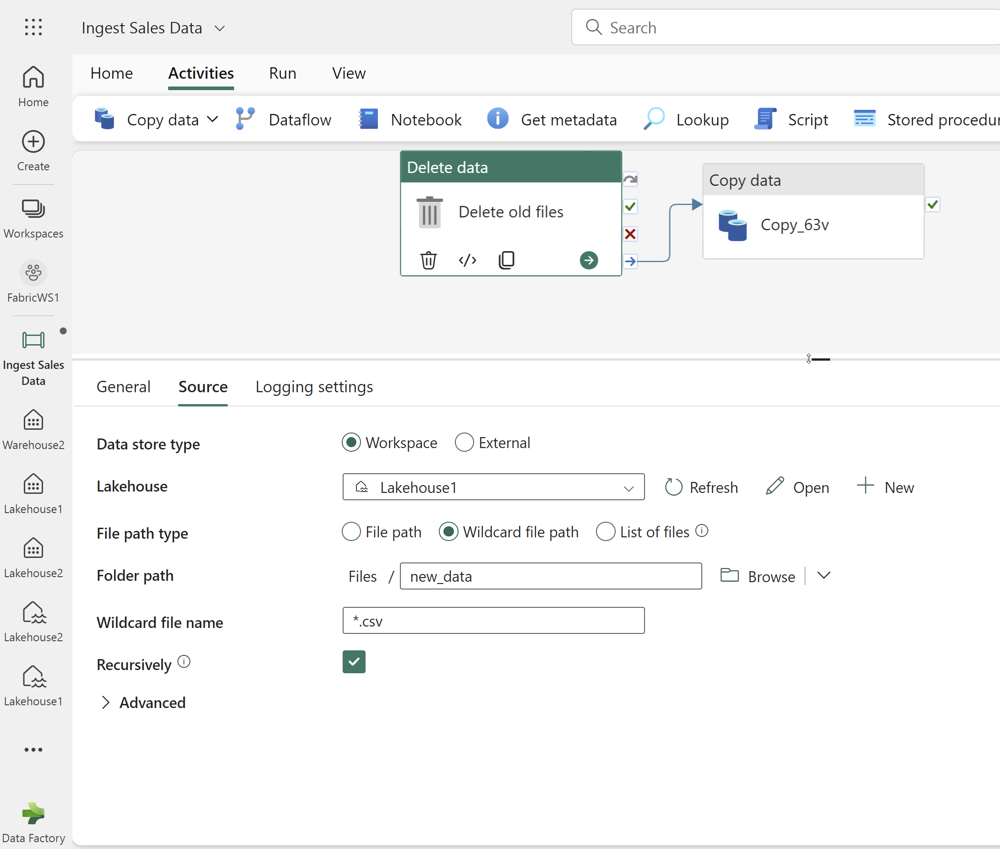
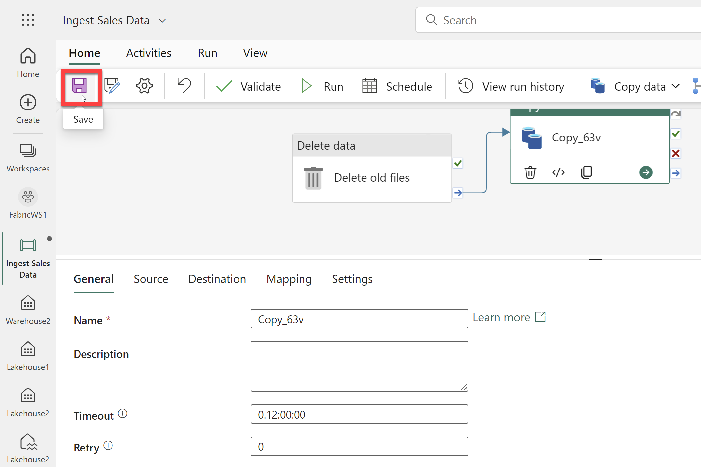
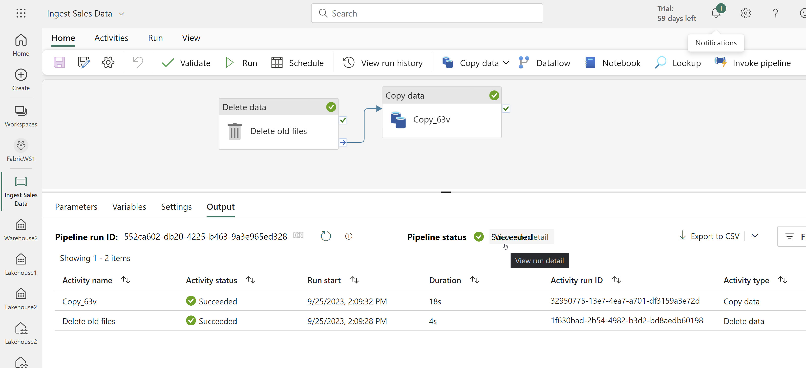
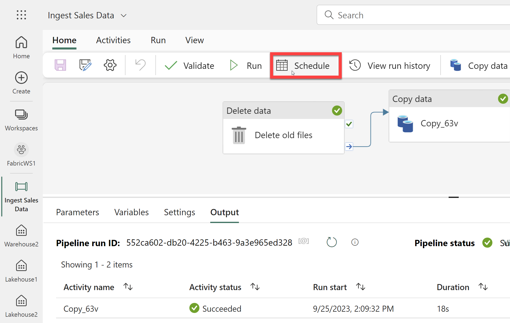

# Lab Guide

## Modify a Data Pipeline

### Overview

In this lab you will change an existing data pipeline to delete data before copying and then schedule the pipeline. 
 
### Time Estimate

- 15 minutes

## Exercise 1: Modify a data pipeline

### Overview

In this exercise, you will modify the pipeline created by the copy tool and then schedule the execution. 

### Time Estimate

- 15 minutes

### Task 1: Modify the Pipeline

1. In a web browser, navigate to the Fabric home page at https://app.fabric.microsoft.com/home. 

2. Select the Data Factory experience. 

    

3. In the menu on the left, select Workspaces and then choose the FabricWS1 workspace. 

    

4. Select the Ingest Sales Data pipeline from the workspace. 

    

5. Select the Delete data activity to add it to the canvas.

    

6. Position the new Delete data activity to the left of the Copy data activity and connect its On completion output to the Copy data activity 

    

6. With the Delete data activity selected, in the pane below the design canvas, set the following properties:
- General:
    - Name: Delete old files
- Source
    - Data store type: Workspace
    - Workspace data store: Lakehouse1
    - File path type: Wildcard file path
    - Folder path: Files / new_data
    - Wildcard file name: *.csv
    - Recursively: Selected
- Logging settings:
    - Enable logging: Unselected

    

7. On the Home tab, use the 🖫 (Save) icon to save the pipeline. 

    

### Task 2: Run and Schedule the Pipeline

1. Use the ▷ Run button to run the pipeline, and wait for all of the activities to complete.

2. Review the status and duration of the activities in the pipeline run on the Output tab below the canvas.
    
    

3. Press the Schedule button on the Home tab. 

    

4. Create a schedule with the following properties and then click Apply: 
- Scheduled run: On
- Repeat: Weekly
- Every: Sun
- Time: 5:01pm 
- Start: leave blank
- End: leave blank
- Time zone: Pacific Time (US and Canada)

    

5. Close the schedule dialog. 

### Summary

In this exercise, you modified an existing pipeline to add a Delete data activity. Then you ran the pipeline to ensure it completed successfully. Finally, you schedule the pipeline to run once a week. 